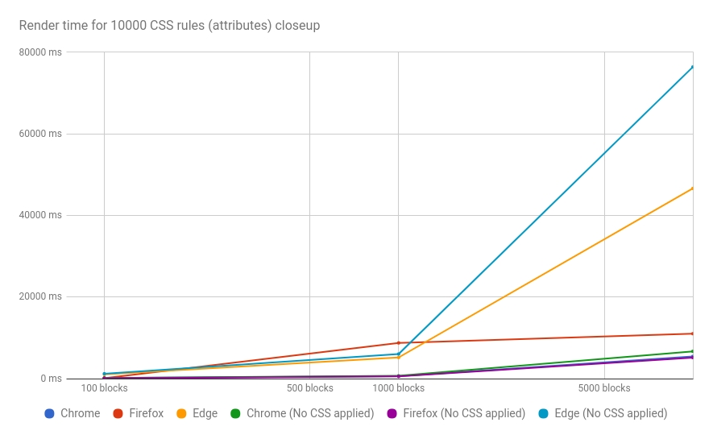

A tale of how we thoughtlessly used a boilerplate with a whole arsenal of dependencies for a project, which nobody used in the end, how it haunted us after, when Edge support was requested, and how we heroically resolved what we had broken before. Wait, it's way too long. A tale of how all browsers are attributophobes, with a select few standing out.

### A little history first

A colleague of mine once approached me with a quite fascinating quest: [C3](http://c3js.org/) (a library for drawing charts) demo became almost unresponsive on Edge when we copied it into our AngularJS app. We got kind of afraid that, if our app was unresponsive, then our customer would also be unresponsive to our payment requests. First thought - let's check-in other browsers. Chrome and Firefox had no doubt the app was nearly perfect performance-wise. Alright, it's gotta be a dependency issue then. We started deleting dependencies from angular.module() one by one. Even when we were passing literally nothing the performance issue still stood. The next logical step - use a performance tracker incorporated into dev tools. Unfortunately, we looked in the wrong direction, analyzing each and every JS function over and over again. As a last resort option, we explored our CSS render time. It was huge! Digging deeper. We were instantly amazed by the size of the compiled and minified CSS file even though we deleted all user styles. It turned out we had [flex-attr](https://github.com/fxlrnrpt/flex-attr) library as a dependency, which (what you think?) nobody used on this project! We inherited it from our corporate internal boilerplate.

What could that library possibly do to freeze Edge for several seconds?

Flex-attr is a set of CSS rules to easily rule flex properties right from HTML. I got acquainted with the approach when I used [Angular Material](https://github.com/angular/material) for one of my projects. Later it's been decided to drop Angular Material, yet I liked the idea. It resulted in a fork with CSS and SCSS only left. I added LESS support and an ability to change a pre-defined set of screen breakpoints. For his project that colleague of mine got that library because he used our internal corporate boilerplate. You see, I added it there myself a few weeks earlier since I wanted to propagate the idea as far as possible. Well, what kind of life is that if can't regularly shoot yourself in the foot? Thank God not in the head and not with a shotgun like Mr. Cobain, though I still have some time to change my mind till my 27th birthday. As it follows from the description, this library is a huge CSS file with lots of rules for attributes ( `[your-attribute]` ). When we deleted it the app came alive and started running better than Forrest Gump. Still, it bothered me much. I wanted a benchmark to understand how far the underlying disease spread its roots (maybe it's just because my life is that hollow and I have nothing better to do, but we are polite well-educated people, we won't think that bad of me, won't we?). I wanted answers. I wanted the understanding of how I should re-write the lib so it stops being on the most effective torture devices of the Holy Inquisition.

### Benchmark

I wrote a [simple Python script](https://github.com/fxlrnrpt/css-attribute-selector-performance-test) to measure performance. Its one and only task is to create a bunch of HTML files with different numbers of blocks and CSS rules for both, classes and attributes. Besides that, it inserts a JS one-liner to actually track execution time.

Structure of an HTML file:

```plaintext
<!doctype html>
<html>
<head>
<title>CSS Tag Selctor Test</title>
</head>
<body>
    <style>
        CSS goes here
    </style>
    <script type="text/javascript">var renderTime = Date.now();window.addEventListener("load", () => console.log(Date.now() - renderTime))</script>

    <div>0</div>
    <div>1</div>
    <div>2</div>
    ...
    <div>n</div>
</body>
</html>
```

Every div has either a class,

```plaintext
<div class="test-selector-0">0</div>
```

or an attribute

```plaintext
<div test-selector-0>0</div>
```

Each CSS rule sets a background-color property for a div. Each block corresponds to a single rule. If number of rules is less than number of blocks then rules are applied again from the top. Execution time (in ms) is assessed by "load" event. It can be found in a console.

A brand new [virtual machine with Windows 10 Enterprise on board](https://developer.microsoft.com/en-us/windows/downloads/virtual-machines) with 4 GB of RAM and 2 cores (in fact, it was only one physical core, but two threads, thanks to Hyper-Threading) was created for tests. I used Microsoft Edge 38.14393.0.0, Google Chrome 60.0.3112.101, Mozilla Firefox 55.0.2. Each time only one browser was open with only one tab active. To minimize any background processes affecting benchmark results each test was run 10 times for every browser. The final value is counted as a median. An exception was made for tests "10000 blocks/10000 attribute rules" and "50000 blocks/10000 attribute rules" for Edge. I ran tests only 5 and 3 times correspondingly. Waiting for a page being rendered for 5-6 minutes is just too much for me. Maybe, I'm just lazy. I'll use the median values down below. If you want to see complete results take a look at [this Google Sheet](https://docs.google.com/spreadsheets/d/1X9qwPK6quxyFk-6Xz1BGt3h2ei6xUDkgTVfkv8-zlXk/edit?usp=sharing).

Results for 100 CSS rules

| Blocks | Chrome  (classes) | Firefox  (classes) | Edge  (classes) | Chrome  (attributes) | Firefox  (attributes) | Edge  (attributes) |
| --- | --- | --- | --- | --- | --- | --- |
| 100 | 4 | 16.5 | 30 | 4 | 18 | 23.5 |
| 1000 | 16.5 | 95.5 | 44 | 19 | 125.5 | 139.5 |
| 10000 | 437.5 | 653 | 382 | 452 | 585 | 1338.5 |
| 50000 | 3489 | 2565 | 5176 | 3566.5 | 2865.5 | 7061 |


Results for 1000 CSS rules

| Blocks | Chrome  (classes) | Firefox  (classes) | Edge  (classes) | Chrome  (attributes) | Firefox  (attributes) | Edge  (attributes) |
| --- | --- | --- | --- | --- | --- | --- |
| 100 | 12.5 | 20.5 | 16.5 | 17.5 | 38.5 | 128 |
| 1000 | 40.5 | 115.5 | 127.5 | 96.5 | 198.5 | 647.5 |
| 10000 | 479 | 618.5 | 974 | 960 | 1242 | 4578 |
| 50000 | 3719.5 | 2877.5 | 5358.5 | 5936 | 6582.5 | 26597.5 |


Results for 10000 CSS rules

| Blocks | Chrome  (classes) | Firefox  (classes) | Edge  (classes) | Chrome  (attributes) | Firefox  (attributes) | Edge  (attributes) |
| --- | --- | --- | --- | --- | --- | --- |
| 100 | 99 | 33 | 24 | 156.5 | 134.5 | 1034.5 |
| 1000 | 149 | 85 | 77.5 | 618 | 8760 | 5185.5 |
| 10000 | 655 | 625.5 | 788 | 5466 | 11020.5 | 46623 |
| 50000 | 3681.5 | 3183.5 | 4743.5 | 36779 | 50663.5 | 326838 |


As you may remember the library that kicked off this whole experiment was connected to the app, but not a single rule was used from it. Thus I wanted to run one more test: compare performance for cases when CSS rules are actually applied to HTML and when they are not (they still are present in CSS, but no one uses them). I added an additional parameter --no\_apply\_css to the original benchmark script to do so.

Results for 10000 CSS rules (if there's nothing in the brackets then CSS rules are applied)

| Blocks | Chrome | Firefox | Edge | Chrome  <sub>(No CSS applied)</sub> | Firefox  <sub>(No CSS applied)</sub> | Edge  <sub>(No CSS applied)</sub> |
| --- | --- | --- | --- | --- | --- | --- |
| 100 | 156.5 | 134.5 | 1034.5 | 177 | 84.5 | 1213.5 |
| 1000 | 618 | 8760 | 5185.5 | 689 | 562 | 6037 |
| 10000 | 5466 | 11020.5 | 46623 | 6700 | 5156 | 76401 |
| 50000 | 36779 | 50663.5 | 326838 | 38750 | 34351 | 431700 |




### Conclusion

As you may notice, the performance of all browsers suffers when attributes are used, starting from a certain size of a CSS file. Yet Edge again proved itself as an outstanding browser by all means. What can be done? First, do not use attribute rules in your CSS. Besides that, be extra careful bringing in a new dependency: it can bring a whole bunch of unwanted attribute rules with itself. As the last test showed it still affects performance even if you don't use these rules. If you can't avoid using attribute selectors for some reason it makes sense to allocate a separate CSS file for them and load it only in time of need. For me personally, the answer is to re-write [flex-attr](https://github.com/fxlrnrpt/flex-attr) with classes and refactor existing projects after that.

