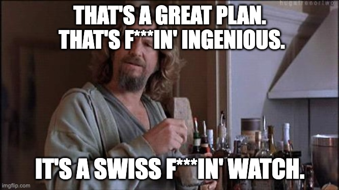
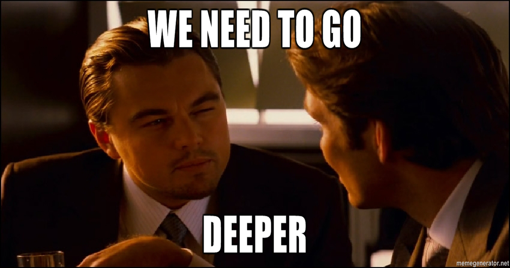

Once upon a time, there was a boy who loved building websites. He also enjoyed sharing his findings at conferences. Then he moved from the middle of nowhere to London. Started working in the company of his dreams. 18 months later he collapsed hard, to a point where he wanted to throw his laptop out of a window and roam the mountains of Scotland indefinitely. After 3 more months, he figured it all out and became happy again.

## Whois

👋 Hi there! My name is Andrey G. I am a software engineer at Meta from London, UK. Fascinated by math, statistics, and physics. In my spare time, I enjoy cycling, hiking, snowboarding, boxing, and weightlifting.

## How it all began

TLDR; Lived in the [middle of nowhere](https://en.wikipedia.org/wiki/Voronezh). Wanted to relocate. Sent out hundreds of applications. Solved about 100 Leetcode challenges. Read a book on system design. Passed 9 interviews. Got 4 offers. Accepted 1. Moved to London.

> Read about the whole journey [here](https://blog.faillearnrepeat.net/how-i-got-multiple-faang-offers-in-europe)

## Peak of inflated expectations

My ambitions moved to London a few weeks ahead of me. When I finally arrived, as a newly born IC5 ("senior") they immediately started pressuring me to get a promo to IC6 ("staff").

I took over a [big undertaking](https://fbflipper.com/blog/2022/05/20/preparing-for-headless-flipper/) from another engineer, and successfully (hopefully!) finalized the project. Next, I started fantasizing how we could apply [Flipper](https://fbflipper.com/) everywhere - from testing infra to kitchen microwaves.

If Flipper had as many integrations as possible, if hundreds of teams relied on it, I could tell that I reinvented a simple debugging app as an ultra-mega-super-duper platform powering a better half of the company. Or I thought I could. Anyhow, sounds like a solid plan, right?

Sadly, our internal research did not correlate well with all of my ideas. The pain of our users seemed to be elsewhere. However, I thought that they simply don't get it yet. When they see it live and play with it, they would have such a jaw-dropping experience that my promo would be as good as done.

I had a teeny-tiny problem - time. Everything and everyone wanted a piece of it: my job, classes in uni, my deadlift that reached a plateau, attempts to complete in boxing, my irrational desire to finally write a [book](https://frontendhistory.dev/). Time is a zero-sum game. If you want to add something, you have to subtract first. I couldn't sacrifice sleep as it would affect my deadlift 🤦. I could borrow time from my family though. They cannot complain, right? After all, I am doing something extremely important - marching towards my promo.

I finished 2 more projects. Their fan base was unsurprisingly... conservative. The numbers did not align with what I had imagined. One other project got canceled.  
Well, if projects did not work out as desired, it is because I had too few of them, right?

I need to generate more ideas, do more, leverage that bloody law of large numbers! Let us see how much more we could cut from the family. Ooops! It was mostly dead already with only rare and sporadic signs of life. I also did not see too much enthusiasm about my new "fantastic" ideas from my colleagues.

## Trough of disillusionment

London turned infinitely dull. I stopped enjoying multi-day debugging sessions of some sneaky perf problems. Doughnuts and Red Bull replaced working out in a gym.

2 months passed by. At that point, I had to overcome my gag reflex not to puke when I merely thought about work. London was downgraded from "infinitely dull" to "abysmal pile of s\*\*t". I started thinking more and more about quitting my job. Just like that. Quit into nowhere and go become a shepherd somewhere in Scotland.

Luckily, I saw a post that in the UK you can officially take a sick leave because of your mental health. I did not really think about it before, because back in my home country people would probably laugh at the very notion of "burnout". I figured that I can quit at any point in time. It couldn't hurt to try taking a mental health leave first.

We could have stopped here and concluded that I was just an arrogant prick thinking too much about myself, too sensitive to handle a project failure. While it is, probably, not too far from the truth, it was not the real underlying problem. It was merely a consequence.

## We need to go deeper

Why do I want that promo in the first place?

Past me would have said, "to get more money". But why do I need more money? Obviously, to buy more cool stuff, travel, and etc. OK, why do I want to buy stuff? After several iterations, we get to the real answer - to be happier. So here is the logic: promo -&gt; money -&gt; happiness. Back then I thought it was a universal truth understood by anyone who ever had to work to put a roof above one's head. By that paradigm, my wife should have been the happiest woman in the world with such a success-driven husband by her side.

Here comes big hairy "but". Why did I feel so awful then? Why my family was miserable?

I spent 2.5 months working with a therapist to figure it out. To figure me out.

Apparently, there was a conflict, but where? Let us take another look at my happiness recipe - "promo -&gt; money -&gt; happiness". Promo indeed leads to more money. No conflict. That leaves us with the only option - the assumption "money -&gt; happiness" is false.

It took me a while to realize that the best moment of my day is when I cuddle with my wife in the evening watching a movie. Yet, I mercilessly sacrificed it chasing success, chasing money. But wait, I do not need a ton of money to watch a movie in the evening from my laptop!

Money still matters to me, but it is not the only thing that does anymore. What really matters is balance. I want to do cool stuff at work to feel intellectual satisfaction. I want to work out every other day to take care of my body to feel well. I want to spend my evenings with my family, to love and to be loved.

Collapse of the axiom "money -&gt; happiness" forced me to re-think what I do for a living. I no longer had to choose a job that maximizes my income. What should be the criteria then? If I could do anything in the world, would I be doing the same job I am doing now?

## Slope of enlightenment

When I was a child I wanted to do 1 of 3 things: 1) design nuclear reactors, 2) build starships, 3) create robots. It does not align well with being a web developer, does it?

After my mental health leave, I realized I want to do something where I enjoy the process and do not care as much about KPIs like money. Given that I have experience in software development, it makes the most sense to switch to AI. I want to do fundamental research and, ultimately, add my two cents to building the next marvel - AGI (Artificial General Intelligence).

As of now, I am trying to cover the knowledge gaps in my own time and investigating how I could join research teams inside the company. If it works out well, I would like to get a PhD in a few years. Wish me luck!

To sum up, follow your dreams, guys!

P.S. I would greatly appreciate your ideas on what would be the best way to switch to research in AI!