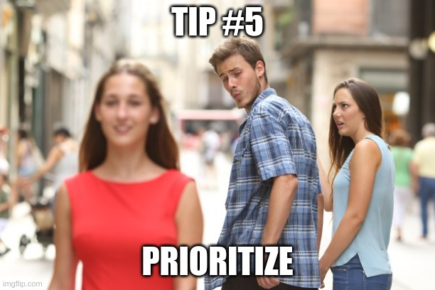

Yet another story of how an ordinary guy from the middle of nowhere in Russia managed to get multiple FAANG offers. This time, in Europe. 
I'll tell you a little about my background, share several tips and tricks that helped me to land the interviews and prepare for them, talk about the interviewing process, reveal my final choice.

> TL;DR. Sent hundreds of CVs. Solved 100 challenges on Leetcode. Read a book on system design. Went through 9 interviews. Got 4 offers. Accepted 1. Lived happily ever after. 

## Background

Hiya!

ℹ️  My name is Andrey G. I am a software engineer from London, UK. Primarily, I am a full-stack web developer (think React, Angular, Node.js), but I also have a keen interest in low-level stuff (hello, C) and finance (love-hate relationship with Pandas).

> G. stands for Goncharov. I wanted to save you the pain of reading my Cyrillic last name.

💼 Full-stack (web, blockchain, and even a bit of embedded) at software consultancies ([DSR](https://en.dsr-corporation.com/), [DataArt](https://www.dataart.com/))  ➡️  Headed front-end development at [Hazelcast](https://hazelcast.com/)  ➡️  Front-end at [Bricks](https://www.thebricks.com/) (next-gen spreadsheet web app) ➡️  Full-time maintainer of [Flipper](https://fbflipper.com/) at [Meta (ex-Facebook)](https://www.facebook.com/).

📝 I write about tech in my [small blog](https://blog.goncharov.page/). 

🎤 Occasionally, I [speak at conferences](https://github.com/fxlrnrpt/talks).

🇬🇧 I help people [get their Global Talent visas](https://42.goncharov.ai/l/uk-global-talent-visa-for-mortals).

🎓 I am currently pursuing a [Master's in Computer Science (OMSCS) from Georgia Tech](https://omscs.gatech.edu/).

❤️ I love math, physics, rational thinking, and figuring out how things work. In my spare time, I enjoy hiking, snowboarding, boxing, and weight lifting.

📫 Stay in touch on [Twitter](https://twitter.com/ai_goncharov), [LinkedIn](https://www.linkedin.com/in/faillearnrepeat/), and [Instagram](https://www.instagram.com/fxlrnrpt/).

🧙 [Buy me a coffee](https://www.buymeacoffee.com/fxlrnrpt) to support my endeavours!

I like thinking of myself as a bit of an adventurer. One adventure I nourished in my mind for a long time was to move to another country. A year ago, this desire matured into concrete actions. I did a [research and outlined a list of countries for the relocation](https://blog.goncharov.page/immigration-with-numbers). Once I had the list of countries identified, I decided to give myself a break until the end of the year. At the end of January, after a week of snowboarding, I felt energized enough to get back to the relocation mission. 

## Sending out applications

Timeline: January - February 2021.

Time to send the actual applications. At first, I thought about applying to only well-known companies. Well-known to me. As I started going through the list of companies in my head, the "to me" part of the previous sentence raised more and more doubts. First, there are great companies out there I haven't even heard of, or, at least, can't remember right away. Second, surprise-surprise, human memory is not perfect. I wrote down the companies I know by heart, and went on with the search. I tried googling various lists of great companies to work at. I browsed dozens of vacancies on LinkedIn. While it all helped my list to grow, the ultimate solution I came up with was to go through the [list of S&P 500 companies](https://www.slickcharts.com/sp500). If that's not enough for you, you can add [NASDAQ](https://www.nasdaq.com/market-activity/stocks/screener) on top of it. 
A natural question here is why only publicly trading companies? First, I had already tried working for small and medium-sized businesses, wanted to try what it feels like to work for a proper corporation at a proper corporation-sized scale. Second, I figured that a FAANG entry on my resume would act as a quality stamp, opening many doors in the future. Third, I hoped that a rigorous hiring procedure would help to concentrate true talent inside of the company. When you are surrounded by people willing to methodically take a VM apart piece by piece just to figure out why one operation works 5% faster than the other one, it, kind of, becomes a new norm for you, don't you think? At least, it is a heck of a story to tell at a conference. Forth, I figured that larger companies would be less afraid to relocate candidates. Last, my wife is about to start her Master's, and FAANG pays pretty darn well. 

> Tip #1. The end of January is too late to start sending out the applications if you consider relocation to the US. Most of the US-based jobs with relocation assume you getting an H1B visa. This type of visa is issued only once a year, and your sponsoring company has to apply all necessary documents by mid-March. FAANG giants rarely operate at this pace.

As many other articles on the web suggest, I tried to find referrals for some of the biggest companies. I reached out to folks I studied with and met at conferences. I even tried reaching out to people I do not know at all asking for a reference. As one of the Googlers told me, when they refer somebody, they put in how well they know a candidate. If it is a referral for an anonymous on the internet, it is worthless. Apart from referrals, I mostly used companies' own websites to apply for the jobs.

The first week of February went by. I sent, probably, several hundred applications. My rough estimate is 400. And... nothing. Some of the companies froze their relocation programs due to COVID, some of them silently ignored me. Cosmic powers, my spidey senses, and just common sense came together and hinted that I need either patience or a new strategy. Further thinking transformed it into "patience AND a new strategy". I thought that even I still might see the fruits of my previous work, a new shiny way of getting a one-on-one with a recruiter wouldn't hurt.

Someone smart once said, "A wise man's question contains half the answer". I wouldn't dare calling myself wise eve remotely, yet when asked myself how I was going to make recruiters notice me, the answer was obvious - send messages to the recruiters, dummy! Without any hesitation, I opened my LinkedIn, found that magical search bar, and started looking for recruiters from the companies I wanted to get in the most.

Website applications got me interviews with Booking in the Netherlands, JP Morgan in the UK, Amazon in Germany, Microsoft in the US, Lyft in the US. Spamming recruiters worked with Uber in Netherlands and Databricks in the Netherlands. It also kind of worked with Microsoft, but Microsoft in Poland, that was not my area of interest. It was a bit complicated with my referral for Facebook. I reached out to Michel Weststrate, whom I knew as a creator of [immer](https://github.com/immerjs/immer) and [mobx](https://www.mobxjs.com/README.html). He was a super-nice guy, and he referred me for a frontend role. I was immediately rejected. I decided not to give up, and asked my ex-colleague from Hazelcast, master of everything distributed, [Ensar Basri Kahveci](https://twitter.com/metanet), for help. I sent him 3 different roles at Facebook I wanted to try - frontend in the UK, generic software engineer in the UK, and something else I don't even remember now. My thinking was that even if my first application for the frontend role was rejected, on a different day a different recruiter might be looking at a new pile of applications, and he might make a different decision about mine. As to the generic software engineer role, I thought that a totally different recruiter might deal with that role, so it was worth a try. On the next day, I connected on LinkedIn to a recruiter from Facebook in London. To my surprise and joy, he read my message! He told me that he saw the referral in the system, and initiated a call.
My last referral that eventually worked came from [Alex Salo](https://www.linkedin.com/in/alexsalo/) - a god of math I met back in my uni days, who now works at Google. I say eventually because I did not have a reliable way to contact Alex, so by the time he referred me, I already maxed out the number of applications one could send to Google in a month. My website applications to Google, US, did not work. So after a month, in March, I tried to apply to Google, Germany, and Google, Switzerland, via Alex's link, and I got the interview!

> Tip #2. Big corporations are gigantic monsters. Every limb of that monster usually functions independently. Apply to different positions in the same region, apply to different regions, apply at different dates. You may fail to pass the filter for 99 job ads, but you will be selected for the 100th.

In the end, I interviewed with Booking, JP Morgan, Amazon (twice!), Microsoft, Lyft, Databricks, Uber, Google, and Facebook.

## Preparation

Most of the big tech companies (if not all) are going to assess your skills based on 3 criteria:

1. Domain-specific knowledge
2. Data structures and algorithms
3. System design
4. Soft skills / cultural fit

### Domain-specific knowledge

You probably won't see it if you apply for a generic software engineer role. These questions will arise if you apply for more specific roles like fullstack engineer, frontend engineer, and etc. I saw them when I tried myself for a fullstack role at Uber and Booking, a frontend role at JP Morgan.
I did not invest any time into preparation for domain-specific questions hoping that my entire career prepared me for them.

### Data structures and algorithms

[Leetcode](https://leetcode.com/). Lots of leetcode.

> Tip #3. I would advise choosing a language you are most comfortable with, even if it does not have all the necessary data structures out-of-the-box. I am most fluent in JavaScript/TypeScript. It lacks many popular data structures like heaps. Every time I needed to use a heap in my solution, my interviewer and I just imagined that I had a library with a reasonable API. From my experience, it is never going to be a problem. Worst case scenario, they ask you to write a heap from scratch. Practice it a couple of times, and it should not present a problem for you.

If you did not touch algorithmic challenges for a while, I would suggest starting with [the easy collection of top interview questions](https://leetcode.com/explore/featured/card/top-interview-questions-easy/). Do not do all of them. Just the recommended ones in each section. After that, I would suggest moving to [the medium collection of top interview questions](https://leetcode.com/explore/interview/card/top-interview-questions-medium/). Like before, go only through the recommended challenges in each section. At this point, you should be able to tell which sections are easier for you, and which are the most problematic. Spend extra time on the sections you find the hardest. Now would be a good time for your first coding interview.

> Tip #4. It is ok to be overwhelmed with the complexity. I spent days and weeks feeling utterly stupid. It gets easier once accumulate the critical amount of knowledge. Set for yourself a strict schedule and follow it. I committed to spending up to 2 hours a day going through one section at a time. Leetcode has 6 coding-related sections in each group. This routine gave me an opportunity to more-or-less evenly progress through each section with one extra day to focus on my weak points.

Once you go through the first coding interviews in several companies, and you identify which companies are still in the game, it might be a good idea to start exploring company-specialized sets of challenges. It is no longer free on Leetcode, but it is worth it. I did not have time to solve the specialized sets for each company I interviewed with, so I decided to focus on Google and Facebook. After all, how different these coding tasks could be in other companies? One week I went through the Facebook set, another week through the Google one. And so on.

### System design

You will be given a high-level description of a system. You will need to design a high-level architecture for the system by drawing boxes and explaining how they are interconnected and why you need them. 

At some interviews you will be asked to focus more on the API design, at others, you will need to provide more insight on how you plan to make the system reliable, going into the depth of availability and performance.

One book that helped me the most was ["System Design Interview – An insider's guide" by Alex Xu](https://amzn.to/2YkXVXc). It is concise, yet covers a dozen typical systems. As I had a chance to do some system design on my daily job, it was the only book I read. I wanted to spend more time on the algorithms. If you want to dig a bit deeper, check out [this great blog post by Gergely Orosz](https://blog.pragmaticengineer.com/preparing-for-the-systems-design-and-coding-interviews/#systems-design-interviews).

> Attention! You might have noticed that my [link to "System Design Interview – An insider's guide"](https://amzn.to/2YkXVXc) is, kind of, long and contains a lot of rubbish. It is an affiliate link. And that rubbish helps Amazon know that I pointed you to that book. Whenever you buy it, Amazon gives me a teeny tiny percentage. If you want to say "thank you" for the article and you are considering buying that book, please, do it via that link. If for some reason you are totally against any affiliate programs here is a ["clean" link](https://www.amazon.co.uk/gp/product/B08CMF2CQF).

### Soft skills / cultural fit

It was probably the easiest part for me. I went through ["Rock the behavioral interview" card on Leetcode](https://leetcode.com/explore/interview/card/leapai/), and wrote down the answers for their questions from my own life and work experience. Do not rely on your memory! Human memory sucks. Write it down.

### Preparation recap

I started sending out applications at the end of January. My last interview was in mid-April just like I planned. It gave me 10 weeks of preparation. The first 2 weeks I spent doing only leetcode for 2 hours a day on workdays, 4 hours on Saturdays, leaving Sunday off. Around that time I had my first technical interview. I kept on going through leetcode at the same pace, but without a day off, for 2 more weeks. Next, I started reading one chapter from "System Design Interview – An insider's guide" every workday in addition to leetcode. Once I finished it, I returned to the old leetcode-only routine. It was not easy. I had a full-time job. I needed to work on my Master's from Georgia Tech. I had to ruthlessly prioritize and make sacrifices. I fell in love with to-do lists. I think what helped me the most is starting my day with the preparation and then gradually going through my to-do list starting with the most important tasks. 

## Interviews

> Tip #5. If your interviewing skills are a bit rusty, most likely, you are going to bomb your first couple of interviews. Engage with all the companies from your list as soon as possible, but try to schedule the technical interview for your dream companies at a later point.

I would be thrilled to work at any of the companies from my list above, so I had a really hard time following the advice from "Tip #4". I slightly preferred some of them over the others, but to be respectful to all of them, I am going to tell you about my interview experience at each one of the companies in no particular order.

### Lyft

I managed to get a call with a recruiter only. It was the end of February, and we just had no time to go through all tech interviews by the time they would have to file for my H1B visa. See "Tip #1". End of story.

Score: 0 / 9.

### Microsoft

I passed the phone call, where I had a leetcode-medium coding challenge. Then after a week of silence, they told me they thought I had a work permit in the US, and they were not willing to sponsor an H1B at that moment. I guess I forgot to click on a non-resident checkbox in my application. Sorry, Microsoft!

Score: 0 / 9.

### Databricks

I failed on the first coding interview. They asked me a medium-complexity leetcode-like question. I did not find the optimal solution. Well, you live, you learn. That's why it is crucial to have several interviews lined up.

Score: 0 / 9.

### Booking

I got two domain-specific interviews. Another interview was split in half. First, it was an easy leetcode-like question, then they extended it to a system design question. At the moment, I was working on an offline-first application with multi-user collaboration. I guess it made me over-engineer my final design. After that, I had a behavioral interview with a manager. In the end, I was told that all went well, but the system design. My recruiter offered me to try for a different team, which I did. It was just another behavioral interview. As result, they told me I did not show enough passion.

Score: 0 / 9.

### Uber

After a quick call with a recruiter, I got my first domain-specific coding interview. At that moment Uber hired for middle-level and senior-level roles. That interview was supposed to put me either on a middle-level track or on a senior one. After the first round, I was evaluated as a middle-level engineer. Subsequently, I had two more leetcode-like algorithmic challenges, a classical system-design interview, and a behavioral interview with a manager. The results were inconclusive. Uber was not ready to offer me a senior role as they thought my coding was weaker than necessary. They were not ready to offer me a middle-level role as they liked my soft and system design skills. They figured I would be bored without constant exposure to architecture-related tasks, and that's something they provide for their seniors. 

Score: 0 / 9.

### JP Morgan

After a call with a recruiter, I was up for a full day of interviews. This time no first screening with a coding challenge. I got two domain-specific sessions with more-or-less standard questions about JS and React. After that, I had a behavioral interview with a manager. They really liked that I managed my own portfolio at that time. It was one of the least stressful interview loops. As result, I got an offer for a senior position with relocation to London!

> Tip #6. If you have experience in the company domain, do not be shy and talk about it! Surprise-surprise, it matters.

Score: 1 / 9.

### Amazon

It is a twisted story that proves tip #2. FAANG corporations do not function as a holistic unit with regard to hiring. You can be rejected in one region, but accepted in a different one!
My first interview was with Amazon in Munich. They sent an online screening test with a couple of easy leetcode-like tasks. Shortly after, I was on a call with an engineer solving a medium leetcode challenge. It took about 30% of the interview, while the majority of the time went into the behavioral part of the interview. I thought I did well... and I was wrong. A few days later, I got a rejection letter.

Be prepared! Amazon asks behavioral questions on every call. Interviews are no longer exclusive to checking one area of knowledge like algorithms or system design. They always check two - your soft skills and either algorithms or system design.

> Tip #7. It is OK to use the same story for all your interviews. Usually, a good life story covers several leadership principles they want to hear.

Luckily, it was not the end of the story. I did not stop applying for various vacancies at Amazon. About a week later I got a call from Amazon Cambridge. They did not seem to know or care about my previous failure with Amazon Munich. They did not even mention it. I got the same online screening test. It had different tasks, but the structure was the same - a couple of easy leetcode challenges and forms to explain why I solved them the way I did. A few days later, I jumped on a call with an engineer from the team. This time it was a bit different - same behavioral questions, but two medium leetcodes. I found the optimal solution for the first but did not manage to do the same for the second one. Nevertheless, I passed. 

After a month of preparation, I met the team over 4 interviews. 2 medium leetcodes, one system design, and one coding task that I would describe as application/API design. The last one presented me with a vague list of business requirements. I had to clarify them, set meaningful constraints, and then code a class implementing the logic. In the end, they loved my algorithms, my application/API design, but did not meet expectations with my system design skills. If only a guy from Uber could have called and told them about my mad system design skills. It could have been the end of the story, but it was far from over. I auditioned for the backend role in Cambridge, and the guys thought that even though I lacked the necessary system design skills for their team, I still could be a good match for a frontend role. The thing was that they did not have any frontend roles in Cambridge. I had another call with a recruiter, and she redirected me to... surprise-surprise, Germany! There and back again.

They set another loop on interviews. This time much shorter. As far as I remember, it was only a single medium leetcode and another system design. This time they loved it and I got an offer. Offer for a middle-level position. At that moment I started doubting my previous "senior" titles.

> Tip #8. Be proactive and talk to your recruiter about the level you are interviewing for. Make convincing arguments, share that you have interviews with other companies for a higher level. The bottom line, do anything to be put in a loop for a higher position.

Score: 2 / 9.

### Google

I received a standard FAANG interview package. One phone screener with a medium leetcode. After 2 weeks of prep, an exhausting day with 5 interviews - 1 behavioral, 1 system design, 3 algorithms. Each algorithmic interview was an easy leetcode followed up by a medium leetcode. System design and behavioral were canonical. I got positive feedback. Positive feedback and approval of the committee! Yes, before you get an offer you need to go through a team matching process. To get there, first, some mysterious committee needs to approve your level. In my case, it was L4 - yet another middle level. My doubts in my previous so-called seniority doubled in size.

Score: 3 / 9.

### Facebook

At first, it seemed like another standard FAANG interview package. However, there was a small catch. They were on a hiring freeze for E4 (middle level). So I had to pass the bar for E5 (senior) without a possible downgrade. A first screening interview with one easy and one medium leetcode. A month of preparation. Finally, 2 days of interviews. 2 algorithmic interviews on day 1. 1 system design and 1 behavioral on day 2. As Mr. Eminem sang, his palms are sweaty, knees weak, arms are heavy... Both algorithmic interviews were "easy leetcode with a medium leetcode followup". I did well on the first one, and absolutely horribly on the second. System design was focused mostly on the API and the DB schema. The behavioral one was more or less standard. They went without a hitch. I heard multiple times about rigorous requirements at FAANG. I was almost ready to say goodbye to this opportunity. Luckily, Facebook was super nice and gave me another chance. They set up another coding interview. If you recollect what Mr. Eminem sang in that song later, it is "There's vomit on his sweater already, mom's spaghetti. He's nervous, but on the surface, he looks calm and ready". Well, I was as far from calm as possible. As result, on the call, I calculated big O for the easy leetcode wrong, but I realized it only after the interview. The interviewer did not seem to notice it or decided not to mention it. However, he thought my solution had a bug. After running various test cases out loud without any luck of finding that bug, I switched to the second part of the interview with the medium leetcode. For that one, I found the best solution and did my math well. I knew that it was my last chance of getting in, and I like thinking of myself as of someone who does not give up that easily. I asked the interviewer to copy-paste my solution for the first task to debug it at home. I created an online test suite with that very implementation and a variety of edge cases. There wasn't a bug! I desperately needed to somehow communicate that sacred knowledge to my interviewer! But how? Facebook does not reveal emails of your interviewers. What it does is reveals their names. It was my lucky day. The guy was an active open source contributor. I found his email in his commits and emailed him the test suite and the correct big O calculation. I do not know if that email had any effect. I never got a reply. At least, I knew I did everything I could. And it worked! A few days later, I received a call from the recruiter with an offer for a senior role in London!

Score: 4 / 9.

## Grand finale

After interviews with 9 different well-known prestigious companies, I got 4 offers. After a week of negotiations ([here](https://haseebq.com/my-ten-rules-for-negotiating-a-job-offer/) is a great guide on how to do it) and hesitations, I happily decided to move to London with Facebook. I now hope for two things. First, that my story helps someone else in the middle of nowhere in a non-English-speaking country realize that they do not need to be a super extraordinary genius to get to FAANG in a major city. All they need is hard work and dedication. Second, that this is the end of a chapter, not the end of a story :) 