Large scale equals distributed. Distributed equals inevitable complexity. Complexity at runtime equals extensive monitoring. At Hazelcast, doing distributed systems well is our bread and butter. It means we have no choice but to be huge fans of collecting all kinds of metrics to stay on guard of the data our users trust us with.    
In Management Center `4.2020.08`, we drastically changed the model of how we transfer the metric data from the cluster members to the Management Center, how we store it, and how we display it. In this post, we are going to talk about the latter bit of the triad.    
We will discuss what to do when you want to display all the data at once, but your users have a limited number of monitors and only one pair of eyes. We will speculate about what users actually want to see when they look at a chart of a monitoring web app. We will go over different approaches to filter the data, and how an average, a median, and a definite integral play their key roles.    

## 4.2020.08! 4.2020.08! 4.2020.08! Why are we so excited?

> If you are not interested in the new features of 4.2020.08 you can jump straight to [what users want to see and why](#the-widget).

This release stands on 3 pillars:

1. Enhanced UX for developers
2. Unification with the Jet Management Center
3. New metric engine

### Pillar 1. Enhanced UX for developers.


We love developers and loathe unnecessarily complex UIs. As you might know, Hazelcast Management Center supports [numerous security providers](https://docs.hazelcast.org/docs/management-center/latest/manual/html/index.html#authentication-options). Prior to 4.2020.08, the default choice was to use username/password based authentication, which we called the "Default" authentication. We are happy to present you with the "Dev Mode" security provider! 

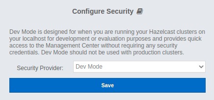

Internally, we call it "Just click save" security provider. Go ahead and [try it yourself](https://hub.docker.com/r/hazelcast/management-center/). We are keen to [hear back from you](https://slack.hazelcast.com/)!

### Pillar 2. Unification with the Jet Management Center.

What the heck is Jet? It is a blazing fast distributed computing platform built on top of Hazelcast In-Memory Data Grid. [Here](https://jet-start.sh/) you can read more about it. Previously, Jet had its own Management Center, but not anymore. One Hazelcast - one Management Center!

### Pillar 3. New metric engine.

Since the dawn of time we used the "push" model to collect the metric data from the cluster. It is not even entirely correct to use the word "collect" here. Collecting is an active process. We received the metric data from the cluster. Every node had to know the address of the management center, and it pushed its metric data to that address. 
With 4.2020.08 we are trilled to reverse that paradigm and start polling cluster members for metric data! It is a huge change but we have not stopped there. Here is a list with new major metric-related features:

1. The "poll" model instead of the "push" one.
2. A new metrics storage for time-series data implemented on top of [RocksDB](https://rocksdb.org/).
3. [Prometheus](https://prometheus.io/) exporter for the metric data. 
3. A new customizable UI widget to display the metric data.

Having that said, let's dive deeper in the anatomy of the widget, and what problems we faced while creating it.

## The widget

### What users want to see and why

What is the purpose of monitoring? One could argue that the whole point is to provide top management with pretty charts and multi-page reports with statistics. Jokes aside. What is the real purpose of monitoring? Why do we stare at all these graphs for ours? The ultimate goal is to detect abnormalities as early as possible. Why? Because any abnormality is a predecessor to potential issues.


Speaking of monitoring in general, we are usually speaking of time series data (a list of data points in time order, in our case they come to the front end as `{ time: number; value: number }[]`). Speaking of monitoring of distributed systems, we are usually speaking of multiple time series. Multiple time series cause multiple problems.

#### Problem 1. How do we analyze graphs?

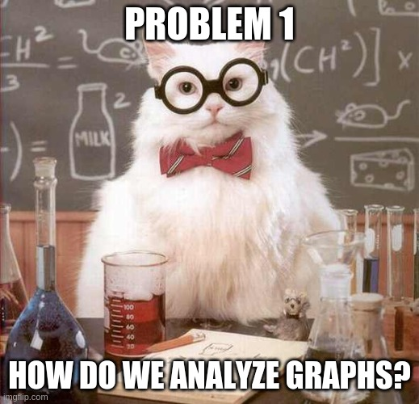

We have several data points. We use fancy or not so fancy methods of interpolation to draw continuous lines that resemble the original continuous real-world data standing behind the discrete data. How do we detect abnormality there?

We can analyze graphs:

1. Individually
2. As a group

For individual analysis, we already have the data points containing scalar values. Comparing scalars is, if not simple, at least doable.

For group analysis, we have to somehow calculate a single scalar out of a time series for each time series, and compare the resulting scalars. There are endless possibilities of how one could do the calculation, depending on the needs of the business. We will go over a small bit of them that we chose for our application down below.

As we can see, for both methods of analysis we end up with a list of scalars that we need to somehow compare.

#### Problem 2. How do we find an abnormality in a list of scalars?

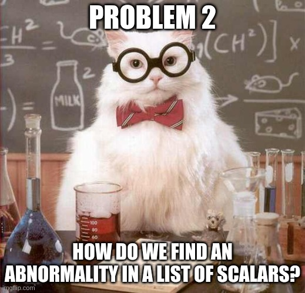

Generally speaking, we have 4 ways of describing abnormality:
1. We can define a range a values that are considered normal. If anything falls out of the range then it is abnormal. For example, we can say that `[-42,42]` is our normal range. Then `7` would be considered normal, and `43` would be abnormal.
2. We can define a predicate for normality. If a value satisfies the predicate than it is considered normal. Otherwise, it is abnormal. For example, we can say that all integer odd values are normal range. Then `7` would be considered normal, and `7.5` or `42` would be abnormal.
3. We can define a range a values that are considered abnormal. If anything falls out of the range then it is normal. Basically, it is a negation of #1.
4. We can define a predicate for abnormality. If a value satisfies the predicate than it is considered abnormal. Otherwise, it is normal. Basically, it is a negation of #2.

We can also detect abnormality iteratively, using different methods (listed above) at different stages, chaining them. For example, we could consider abnormal only integer odd values that belong to `[0, 42)`.

With a few exceptions, predicates make the most sense for analyzing potentially infinite lists, as they, usually, require limited processing power and memory.

Ranges are not that simple. Ranges can be:

1. Static
2. Dynamic

Static range is constant predefined range that does not change when new metrics data comes in. Say, we have a cluster of 30 machines. Every machine has 16 GB of RAM. Knowing the average expected load, we could identify the normal range for the used RAM as `[1.6 GB, 14.4 GB]` (from 10% and up to 90%). That would be a perfect example of a static range. It does not depend on the number of machines or the phase of the moon.

For some metrics and under certain conditions, we could define a range of normal values beforehand, without analyzing the metric data itself. However, not all metrics have a universal predefined range of possible values that make sense for any system. For those metrics, we have to evaluate them by comparison to their peers, i.e. process the whole list of scalars to define the normal range, and then process the list all over again to identify the abnormal range. We can see that the complexity here scales at least linearly with the size of the list.

As a result, we see that abnormality could be identified in 2 ways:

1. Absolutely
2. Relatively

The absolute abnormality detection is simpler to understand and implement. It also, usually, requires less processing power as it does not require a dynamic range calculation. It could be used on a potentially unlimited list of scalars. However, it has a restricted area of application as not all metrics have a constant predefined range of metrics.
The relative abnormality detection is more complex. It requires a dynamic range calculation and, therefore, could be used only on the limited list of scalars. However, it could be applied to any metric in the cluster.

The absolute abnormality detection requires users to have deep knowledge of the system to define the normal/abnormal range. In comparison, the relative abnormality detection allows users to easily identify if any metric on any node significantly deviates from the average cluster value without the prior knowledge of the system, or without the expert knowledge of the normal reference range for the system.

#### Problem 3. How do we display the abnormality?

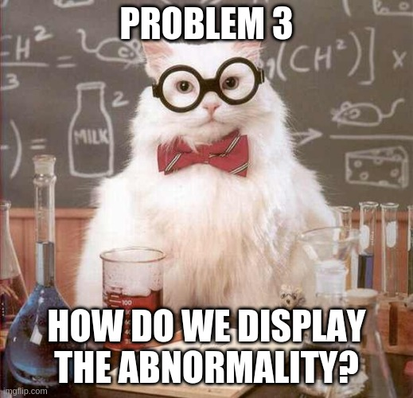

Say, we have 100 time series. We identified 20 of them as abnormal. How do we display them? 

We could display all 100 graphs, and somehow mark the 20 abnormal ones. For instance, we could color code them, but would you be comfortable browsing through 100 graphs? I certainly would not be. I seriously doubt any living human being could make any sense of that mess.

We could display only the 20 abnormal ones. But then we wouldn't know what is considered normal. What was the benchmark against which we identified the abnormality?

Should we display the 20 abnormal ones and additionally draw a graph with the calculated reference value, considered normal? Yes and no! Yes, because it is the correct principal. We should display the abnormal lines along with the reference normal one. No, because 20 graphs are still too much to comprehend. Various studies on how many items a human being can focus on simultaneously show different results on a range from 3 to 7-9. As the final number varies from study to study, it is still a single-digit number everywhere. It means that `20` is still not good enough. How do we go from `20` to a single-digit number?

Previously, we said we could detect abnormality iteratively. Why don't we apply that idea here? Once we detect the initial list of abnormal scalars, we could sort them in the ascending order by their deviation from the reference normal scalar, and leave only those with the biggest deviation.

After experimenting a bit ourselves, we decided that 4 is a good number. So for a single metric we decided to display up to 3 abnormal graphs along with the reference normal one.

### Filters

Hazelcast cluster could have hundreds of members. It means that for every metric we have hundreds of time series. We could not display all of them. Inevitably, we had to somehow help our users to find the abnormality and filter out the result graphs.

As of Management Center `4.2020.08`, we provide our users with 6 different filters:

1. Peak Top 3
2. Peak Bottom 3
3. Average Top 3
4. Average Bottom 3
5. Outliers
6. Manual Selection

#### Manual Selection


Let's start with the most boring one - Manual Selection. It allows users to select several members out of the list of cluster members they want to see the metric data for. Our front end receives the data only for those members. Piece of cake.

#### Peak Top 3/Peak Bottom 3

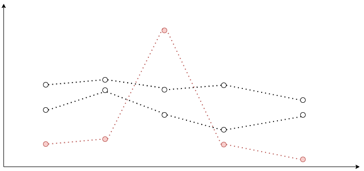

Do you remember what we have to do to analyze time series as a group? We have to calculate a scalar value for every time series. When you think of a calculation approach, one of the first things that comes to mind is just to take the absolute maximum value of the function. 

Given that every data point is `{ time: number; value: number }`, the implementation is straightforward:

```ts
const timeSeriesResScalar = Max.max(timeSeries.map(({ value }) => value))
```

After that, we sort our multiple time series in the descending order by their calculated scalars, and take the first 3 time series. We call this filter `Peak Top 3`. For the `Peak Bottom 3`, we swap `Math.max` for `Math.min`, but the idea is the same.

We do not calculate any average cluster value (a reference normal value) with this approach, leaving the final judgment of normality to the admin. However, we might start doing it if there is a strong demand.     

Have you noticed any problems with the Peak filter? One data point with an extraordinary value can make the whole time series range higher even though all other data points have rather small values. For some metrics with modest volatility Peak filter is exactly what we need. Those short term surges could indicate a potential abnormality. But what about highly volatile metrics? We need a way to minimize the effect of those short-term spikes on the result scalar. Here is where the story of mean and median begins.

#### Mean and median

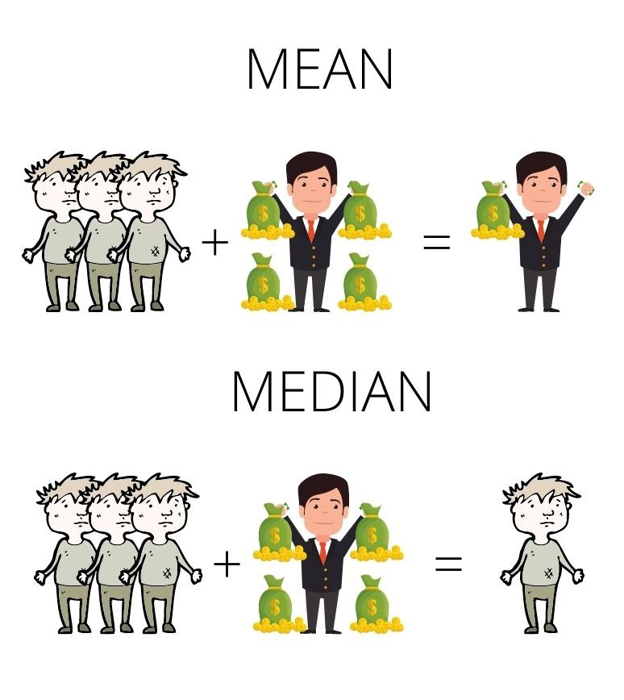

Barry has 4 pots of gold. Amy, John and Douglas have 0. The mean value here is 1. The median, however, is 0. How do we calculate them? 

Mean is the average you are used to. Calculate the sum of the items in the list and divide it by the number of the items.
Median is the middle value of the list. Sort the list in the ascending order. If the number of items is odd, the middle item of your sorted list is the median. If the number of items is even, sum two middle numbers and divide them by 2. 

In terms of monitoring it means that mean accounts for extraordinary spikes. Several of them can drastically change the resulting scalar. Median, on the contrary, filters out the surges. 

Should we stop at the mean and the median though?

#### Average by integral

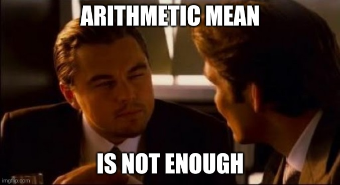

Let me rephrase it. Should we stop at the arithmetic mean and the median though? After all, we are not calculating an average of a list of simple numbers, these are data points of a time series. By extracting only values and operating only on the values we simply disregard the time factor.    

Consider these two graphs:

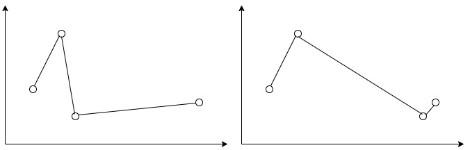

The arithmetic means for their values are the same. Do you think they adequately represent the average value for both functions? What scalar value could be used to describe a function?

It is the area under the curve. Ladies and gentlemen, please, give your warmest welcome to the definite integral!    

Usually, we are speaking of a definite integral of a function, but with a time series we do not have a function. Instead, we have a list of discrete data points. Luckily, we do not have to reinvent the wheel. There is an area of study in math researching specifically this problem called numerical integration of discrete data or discrete data integration.    

There are various methods of discrete data integration. We will consider only one of them. The one we used for the widget - the trapezoidal rule.    

Consider the following graph:

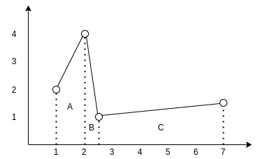

You can see how the data points of the time series form 3 trapezoids. To find the area under the interpolated curve we need to find areas of those 3 trapezoids and sum them up.

For trapezoid `A` it is `((2+4)/2)*(2-1)` and equals `3`. For trapezoid `B` it is `((1+4)/2)*(2.5-2)` and equals `1.25`. For trapezoid `C` it is `((1+1.5)/2)*(7-2.5)` and equals `5.625`. So the final square is `3+1.25+5.625` and equals `9.875`.

To find the average value of the function we now only need to divide its area by its projection on the `x` axis. Imagine it as if we are trying to find the height of a rectangle with the same length as the projection of the function and with the same area.    

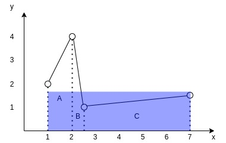

So the TypeScript function to find the average could look like this:

```ts
export const averageByTrapezoidalRule = (
  data: { value: number; time: number }[],
): number => {
  let totalArea = 0

  for (let i = 0; i < data.length - 1; i += 1) {
    const point1 = data[i]
    const point2 = data[i + 1]

    totalArea += ((point2.value + point1.value) / 2) * (point2.time - point1.time)
  }

  const average = totalArea / (data[data.length - 1].time - data[0].time)

  return average
}
```

#### Average Top 3/Average Bottom 3

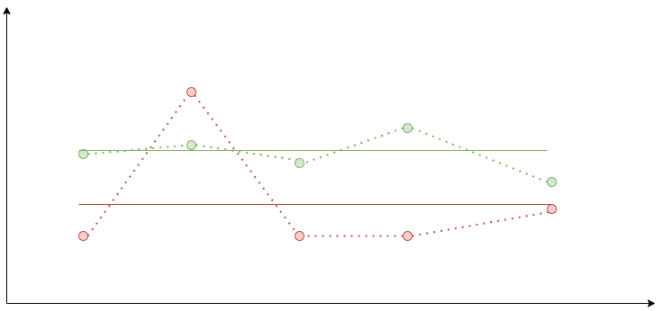

With all that knowledge, let's now build an algorithm for the `Average Top 3` filter:

1. For every time series calculate its average by the trapezoidal rule.
2. Sort the multiple time series in the descending order.
3. Take the first 3 of them.

For the `Average Bottom 3` we just reverse the sorting.

For both of these filters, we still do not calculate any average cluster value (a reference normal value) leaving the final judgment of normality to the admin.    

#### Outliers

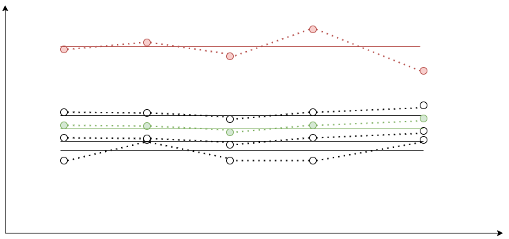

Alrighty, so all previous filters require some expert knowledge of the system to identify if the displayed values are normal or abnormal. Could we create a filter that unleashes the whole power of the relative abnormality detection, and helps us find the abnormal graphs based on the peer values?

It is our default filter. We call it the `Outliers` or simply `auto`. The core idea is to calculate the reference normal value based on the multiple time series as some sort of average. Calculate averages for every time series using the trapezoidal rule. Compare their averages with the reference value. If it deviates from the reference value by more than 30%, consider it abnormal.

The trick is with finding the reference value. Originally, we did it all on the frontend.

1. We calculated averages for every time series.
2. We calculated a median of those averages.
3. We used the median as the reference value.

Why the median? Say, you have a cluster of 10 nodes. 2 of those nodes deviate from the median by some extreme value, say, 300%. They could shift the reference value, so one of the normally behaving members could start being an outlier. The median mitigates the effect of outliers on the reference value.

Later, our backend provided us with a cool aggregation API for the metric time series data. So now we:

1. Request the `MEDIAN` aggregate for all nodes.
    1. `MEDIAN` aggregate is a time series as well. For its every data point it takes values for all nodes for the timestamp, and returns a median of those values.
2. Calculate the average of the median time series.
3. Use the calculated average as the reference value.

Now we disassembled our reference value calculation. Only one last question still stands. What happens when there are too many outliers?

If we find more than 3 outliers we sort the outliers in the ascending order by their deviation from the reference value, and take only the top 3 with the greatest deviation.

The final `Outliers` algorithm looks like this:

1. Request the `MEDIAN` aggregate.
2. Display it as a dashed graph on the chart.
3. Calculate its average by the trapezoidal rule. Consider it a reference value.
4. Calculate averages for every time series.
5. Leave only ones that deviate from the reference value by more than 30%.
6. Sort them in ascending order by the deviation. Display the top 3 time series with the greatest deviation.

As you can see, with the `Outliers` we have the reference graph, so it is easy to understand what is considered normal at first glance.

## Future plans for the widget

Going further, we would like to:

1. Make the outliers threshold adjustable.
2. Allow zooming and out for both X and Y axes.
3. Make the maximum number of graphs adjustable.

We encourage you [try he new Management Center yourself](https://hub.docker.com/r/hazelcast/management-center/), and get back to us with your [feedback](http://slack.hazelcast.com/)! Stay tuned for the new posts with the lessons we learned a truly distributed enterprise-ready in-memory data grid.