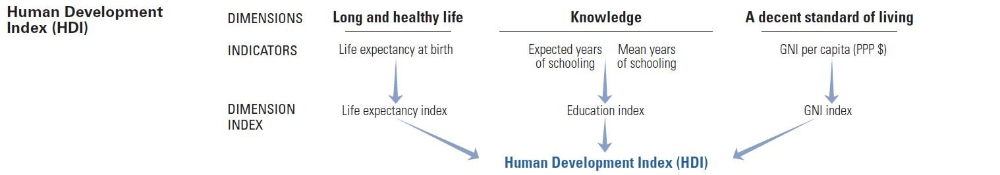

So, you have decided to move your ass someplace else, seeking a better life. The whole world is at your feet, but "the whole world" is not a specific place where you can be. You have to choose, if not a city, at least a country. Nowadays, there are plenty of places where your career can skyrocket, and you can have a great quality of life. Of course, it depends on your definition of the "quality of life". In this article, we will try to set subjective factors that drive your decision aside. We will look at the numbers in different areas to rate and, later on, filter our potential relocation prospects for the next X years.

> If you are more comfortable reading in Russian check out [this article on habr.com](https://habr.com/ru/post/510610/).

## Hiya!

ℹ️  My name is Andrey G. I am a software engineer from London, UK. Primarily, I am a full-stack web developer (think React, Angular, Node.js), but I also have a keen interest in low-level stuff (hello, C) and finance (love-hate relationship with Pandas).

> G. stands for Goncharov. I wanted to save you the pain of reading my Cyrillic last name.

💼 Full-stack (web, blockchain, and even a bit of embedded) at software consultancies ([DSR](https://en.dsr-corporation.com/), [DataArt](https://www.dataart.com/))  ➡️  Headed front-end development at [Hazelcast](https://hazelcast.com/)  ➡️  Front-end at [Bricks](https://www.thebricks.com/) (next-gen spreadsheet web app) ➡️  Full-time maintainer of [Flipper](https://fbflipper.com/) at [Meta (ex-Facebook)](https://www.facebook.com/).

📝 I write about tech in my [small blog](https://blog.faillearnrepeat.net/). 

🎤 Occasionally, I [speak at conferences](https://github.com/fxlrnrpt/talks).

🇬🇧 I help people [get their Global Talent visas](https://github.com/fxlrnrpt/uk-global-talent-visa-guide).

🎓 I am currently pursuing a [Master's in Computer Science (OMSCS) from Georgia Tech](https://omscs.gatech.edu/).

❤️ I love math, physics, rational thinking, and figuring out how things work. In my spare time, I enjoy hiking, snowboarding, boxing, and weight lifting.

📫 Stay in touch on [Twitter](https://twitter.com/fxlrnrpt), [LinkedIn](https://www.linkedin.com/in/faillearnrepeat/), and [Instagram](https://www.instagram.com/fxlrnrpt/).

## Criteria

Before we do the measurement itself, we need to know what to measure. So what do we expect from our new home?

1. Freedom! Freedom of speech, freedom of political and religious views, functional democratic institutes.
2. No corruption... Ok, let's leave ponies and unicorns in our hopefully happy childhood memories. As little corruption as possible. I would like to see where my taxes go.
3. Powerful economy. Free market, relaxed regulations, highly diversified high-tech economy. Living off oil and gas is not a good long-term vision.
4. Wealth, comfort, safety. As software engineers, we can make decent money at any point of the globe. However, our well-being is not everything. Well-being of our neighbors, who are not software engineers, matters as well. Let's just suppose that when the basic needs are satisfied, human beings tend to get creative, self-improve, create new breakthrough companies, and, therefore, lead the nation to new highs. I am not a socialist in any way. I am just saying that your new Tesla might not make you half as happy if dozens of people next to you barely make enough money for food and clothes.
5. Soft immigration policy. Permanent residence in X years. Passport in X + Y years. Work permit for your spouse. 
6. Moderate taxes. Who wants to pay more, right?
7. Hot IT job market. Yes, there are plenty of remote opportunities, but, most probably, you will need a local job to get that work visa.
8. Science. Well-developed and well-sponsored science. Let's just suppose it will lead to more innovation in the technological sector of the economy. Moreover, I, personally, would love to believe that at some point in my life I will do research. After all, I might get tired of making my React application draw just another form to save just another JSON with user data to the database.
9. Strong army. "People who do not want to feed their own army will soon be forced to feed someone else's." That is, allegedly, Mr. Napoleon Bonaparte, not me.
10. Immigrant integration and language. Ideally, people should care not where you come from, but what human being are you. Ideally, they should speak English. I can barely come up with a 10-word sentence without 10 mistakes in it, please, do not make me learn another language!
11. Strong passport that allows as many visa-free entries to different countries as possible.

## Approach

To be at least relatively object we will not base our judgment on beautiful or not so beautiful stories and videos of various bloggers, vloggers, and who-knows-what-loggers. Instead, I suggest using indices by, in most cases, non-profit independent organizations.

1. Freedom
    1. [Freedom House](https://freedomhouse.org/countries/freedom-world/scores?sort=desc&order=Total%20Score%20and%20Status). Locates in the USA. They promise a rating of political and civil liberties in 210 countries. Founded in [1941](https://freedomhouse.org/about-us/our-history). [Funded, mostly, with US federal grants](https://freedomhouse.org/sites/default/files/2020-02/FINAL_Freedom_House_Financial%20Statements_2018.pdf).
2. Corruption
    1. [Transparency International Corruption Perceptions Index](https://www.transparency.org/en/cpi/2019/results/table). Located in Berlin, Germany. Transparent, publish [annual budget reports](https://www.transparency.org/en/the-organisation/our-operating-budget). There is [a huge list](https://www.transparency.org/en/the-organisation/who-supports-us) of those, who chip in for the research. 
3. Economy
    1. [Index of Economic Freedom](https://www.heritage.org/index/ranking) by American [Heritage Foundation](https://www.heritage.org/about-heritage/mission). Mostly funded by [individuals](https://thf-reports.s3.amazonaws.com/Financial/2019_AnnualReport_Financials.pdf). Who exactly? I wish I knew.
    2. [The Global Competitiveness Report](http://www3.weforum.org/docs/WEF_TheGlobalCompetitivenessReport2019.pdf) by [World Economic Forum](https://www.weforum.org/). Powerful community with [50-year history](https://www.weforum.org/about/history). They claim a [remarkable list](https://www.weforum.org/about/our-members-and-partners) of partners. They publish [an annual report](http://www3.weforum.org/docs/WEF_Annual_Report_18-19.pdf) on how they spend the money. However, it is unclear how much they get from each partner.
    3. [Atlas of Economic Complexity](https://atlas.cid.harvard.edu/rankings) by [Growth Lab in Harvard](https://growthlab.cid.harvard.edu/).
4. Wealth, comfort, and safety
    1. [Human Development Index](http://hdr.undp.org/en/content/2019-human-development-index-ranking) by [United Nations Development Programme](https://www.undp.org/content/undp/en/home/). [Funded mostly by European Union and North America](https://www.undp.org/content/undp/en/home/funding/core-donors.html). 100% [transparent](file:///home/andreygoncharov/Downloads/UNDP-Funding-Compendium-2018.pdf).
    2. [Gross National Income per Capita](https://data.oecd.org/natincome/gross-national-income.htm) and [Average Annual Wages](https://stats.oecd.org/Index.aspx?DataSetCode=AV_AN_WAGE) by [OECD](http://www.oecd.org/). Funded by [37 countries](http://www.oecd.org/about/members-and-partners/). Transparent [structure](http://www.oecd.org/about/document/list-of-departments-and-special-bodies.htm) and [budget](http://www.oecd.org/about/budget/).
    3. [Victims of Intentional Homicide](https://dataunodc.un.org/content/homicide-rate-option-2) by [UNODC](https://dataunodc.un.org/). Yep. United Nations itself. Lots of [docs](https://research.un.org/en/docs/budget/documents) on where the money comes from.
5. Army
    1. [SIPRI Military Expenditure](https://www.sipri.org/databases/milex) by [Stockholm International Peace Research Institute](https://www.sipri.org/). It is unclear how exactly they spend their budget, but they have [a detailed list](https://www.sipri.org/) of those, who provide it.
6. IT job market
    1. Let's take a number of job openings on [LinkedIn](https://www.linkedin.com/jobs/search/?f_F=it) and divide it by [the population](https://www.census.gov/popclock/world/) in millions. For Russia, we will get the vacancies from the local resource - [hh.ru](https://hh.ru/search/vacancy?st=searchVacancy&text=&specialization=1&salary=&currency_code=RUR&experience=doesNotMatter&order_by=relevance&search_period=&items_on_page=50&no_magic=true&L_save_area=true).
7. Immigrant integration and language
    1. [Migrant IntegrationPolicy Index](http://www.mipex.eu/play/). There is [a list of partners and experts](http://www.mipex.eu/who-produces-mipex). I could not find the detailed info on the budget.
    2. [EF English Proficiency Index](https://www.ef.com/wwen/epi/). Since there is no huge "Donate" button on the website, I assume the organization is commercial. Private commercial organization. So no reports. Sorry, I could not find anything better. At least they [sponsored the Olympics](https://www.ef.com/wwen/about-us/our-history/) several times.
8. Passport strength
    1. [Passport Index](https://www.passportindex.org/byRank.php?f=) by [Arton Capital](https://www.artoncapital.com/). "Capital", kind of, gives us a hint about the commercial nature of the organization. Unfortunately, nothing better.
9. Science
    1. Let's take ["Share" value from Nature Index](https://www.natureindex.com/country-outputs/generate/All/global/All/score) and divide it by [the population](https://www.census.gov/popclock/world/) in millions. Published by [Nature](https://www.nature.com/). Commercial. If we trust Wikipedia it is extremely [respectable](https://ru.wikipedia.org/wiki/Nature).
10. Taxes
    1. [International Tax Competitiveness Index](https://taxfoundation.org/publications/international-tax-competitiveness-index/) by American [Tax Foundation](https://taxfoundation.org/). Finally, another non-profit! They publish [a financial report](https://files.taxfoundation.org/20200422120938/TaxFoundation_2019AnnualReport1.pdf), but it is still unclear how exactly it is funded.
    2. [All-in average personal income tax rates at average wage by family type](https://stats.oecd.org/index.aspx?DataSetCode=TABLE_I6#) by good old [OECD](http://www.oecd.org/).
11. Immigration policy
    1. There are some indices trying to somehow rate the migration by people inflow and outflow, but it is not what we are after. We need to rate based on the following criteria:
        1. Requirements for immigration visa.
        2. Requirements for permanent residence.
        3. Work permit for spouse.
        4. Requirements for naturalization.
        5. Multiple citizenship, i.e. if we need to give up an existing passport to be naturalized.
    Since there is no easy way to assess these factors, we will, first, filter the countries by other indices, and then have a detailed look at the immigration policy of the finalists.

> If you want to play with the data right away [here is the link to the Google Spreadsheet](https://docs.google.com/spreadsheets/d/1ptwI1So-BxxeGKyoMaIHlFm-AjsxjTXu0tZkkGjqlv0/edit?usp=sharing). I am currently located in Russia. So do not get surprised with a separate bottom row with the numbers for Russia. Feel free to clone the table and replace it with the country you want.

## Filter by freedom

We will use the [Freedom House Index](https://freedomhouse.org/countries/freedom-world/scores?sort=desc&order=Total%20Score%20and%20Status). They rate political and civil liberties. We could have simply taken all the countries marked as `Free` (rating above 70 with a few exceptions). Immigration is a big deal. Let's shoot for the stars and raise the bar to `80`. Results:

- Netherlands
- Germany
- Luxembourg
- Switzerland
- Singapore
- France
- Ireland
- United States
- Belgium
- United Kingdom
- Austria
- Canada
- Sweden
- Australia
- Czech Republic
- Denmark
- Spain
- Italy
- Finland
- New Zealand
- Japan
- Norway
- South Korea
- Iceland
- Slovenia
- Cyprus
- Poland
- Greece
- Lithuania
- Slovakia
- Latvia
- Portugal
- Chile
- Croatia
- Argentina
- Estonia
- Romania
- Bulgaria
- Uruguay
- Trinidad and Tobago
- Panama
- Costa Rica
- Mongolia
- Ghana
- Taiwan

Here we face the first evidence that humans can never stay 100% objective. I've heard so much nice stuff about Singapore, so I decided to let it pass trough to see how it performs by other criteria.

## Filter by [Human Development Index](http://hdr.undp.org/en/content/2019-human-development-index-ranking)

Truly remarkable rating built on 3 pillars: life expectancy, education, and wealth.

If I had to use a single index, I would choose this one. Multi-factor ratings rule!
Let's sort the countries in descending order by Human Development Index.

| Country | Human Development Index |
|--------|-----|
| Norway | 0.954 |
| Switzerland	|	0.946 |
| Ireland	|	0.942 |
| Germany	| 0.939 |
| Iceland	| 0.938 |
| Sweden	| 0.937 |
| Singapore	| 0.935 |
| Netherlands	| 0.933 |
| Denmark	| 0.93 |
| Finland	| 0.925 |
| Canada	| 0.922 |
| New Zealand	|	0.921 |
| United States	| 0.92 |
| United Kingdom	| 0.92 |
| Belgium	| 0.919 |
| Japan	| 0.915 |
| Austria	|	0.914 |
| Australia	| 0.914 |
| Luxembourg	| 0.909 |
| South Korea	|	0.906 |
| Slovenia	|	0.902 |
| Spain	|	0.893 |
| France	|	0.891 |
| Czech Republic	|	0.891 |
| Italy	|	0.883 |
| Cyprus	| 0.873 |
| Poland	|	0.872 |
| Greece	|	0.872 |
| Lithuania	|	0.869 |
| Slovakia	|	0.857 |
| Latvia	| 0.854 |
| Portugal	|	0.85 |
| Chile	| 0.847 |
| Croatia	|	0.837 |
| Argentina	|	0.83 |
| Estonia	|	0.822 |
| Romania	| 0.816 |
| Bulgaria	| 0.816 |
| Uruguay	| 0.808 |
| Trinidad and Tobago	| 0.799 |
| Panama	| 0.795 |
| Costa Rica	| 0.794 |
| Mongolia	| 0.735 |
| Ghana	| 0.596 |

Look at that! My bet on Singapore paid off!
I love simplicity, so I would like to take `0.9` as the bottom line. One thing stopping me is that Microsoft has an office in Prague. I do not want to discard a chance to work there just because the number was slightly lower than I wanted. So let's take `0.891` as the bottom line to let Czech Republic pass to the next stage.

We are now left with:

- Norway
- Switzerland
- Ireland
- Germany
- Iceland
- Sweden
- Singapore
- Netherlands
- Denmark
- Finland
- Canada
- New Zealand
- United States
- United Kingdom
- Belgium
- Japan
- Austria
- Australia
- Luxembourg
- South Korea
- Slovenia
- Spain
- France
- Czech Republic

## Filter by population

Luxembourg and Iceland show great results so far. Population there is `0.62` and `0.35` millions of people respectfully. I reckon these countries might easily be by-invitation-only clubs that do not welcome new members. To make filtering a bit easier, let's assume that we will only consider countries with 5 million of people and greater. Time to say goodbye to Luxembourg, Iceland, Slovenia, and New Zealand.

Here is what is left:
- Norway
- Switzerland
- Ireland
- Germany
- Sweden
- Singapore
- Netherlands
- Denmark
- Finland
- Canada
- United States
- United Kingdom
- Belgium
- Japan
- Austria
- Australia
- South Korea
- Spain
- France
- Czech Republic

## Filter by corruption

We will rely on the data by [Transparency International Corruption Perceptions Index](https://www.transparency.org/en/cpi/2019/results/table). 

| Country | Corruption Perceptions Index |
|--------|------------------------------|
| Denmark	| 87 |
| Finland| 86 |
| Switzerland	| 85 |
| Singapore	| 85 |
| Sweden | 85 |
| Australia	| 85 |
| Norway | 84 |
| Netherlands |	82 |
| Germany	|	80 |
| United Kingdom | 77 |
| Austria | 77 |
| Canada | 77 |
| Belgium	| 75 |
| Ireland	|	74 |
| Japan	|	73 |
| France	|	69 |
| United States	|	69 |
| Spain	|	62 |
| South Korea	|	59 |
| Czech Republic | 56 |

I wish I could take `75` as the bottom line, but it would effectively filter out the USA with tons of amazing work opportunities. Let's adapt our wishes to reality and say that `69` also sounds not that bad.

We now have:

- Denmark
- Finland
- Switzerland
- Singapore
- Sweden
- Australia
- Norway
- Netherlands
- Germany
- United Kingdom
- Austria
- Canada
- Belgium
- Ireland
- Japan
- France
- United States

## Economy

As the primary economic filter, we will use [Index of Economic Freedom](https://www.heritage.org/index/ranking). It rates inviolability of private property, the effectiveness of the jurisdictional system, the amount of national debt, taxes, business opportunities, and my beloved market freedom.
The creators of the index mark countries as `Free` if they score over `80`. They say the countries are `Mostly Free` if they score over `70`. Let's leave only `Free` and `Mostly Free` ones.

| Country | Economic Freedom |
|--------|------------------|
| Singapore |	89.4 |
| Australia	| 82.6 |
| Switzerland	|	82 |
| Ireland	|	80.9 |
| United Kingdom | 79.3 |
| Denmark	|	78.3 |
| Canada	|	78.2 |
| Netherlands	|	77 |
| United States	|	76.6 |
| Finland	|	75.7 |
| Sweden	|	74.9 |
| Germany	|	73.5 |
| Norway	| 73.4 |
| Austria	|	73.3 |
| Japan	|	73.3 |
| Belgium	|	68.9 |
| France | 66 |

Farewell, Belgium, and France.

Nd to the next stage pass:

- Singapore
- Australia
- Switzerland
- Ireland
- United Kingdom
- Denmark
- Canada
- Netherlands
- United States
- Finland
- Sweden
- Germany
- Norway
- Austria
- Japan

You will be surprised, but even at this stage no poor countries left. In all of the above gross national income per capita (smart word for "person") is over $40000. Average salary is also above $40000.

| Country | [Gross National Income](https://data.oecd.org/natincome/gross-national-income.htm) | [Average Salary](https://stats.oecd.org/Index.aspx?DataSetCode=AV_AN_WAGE) |
|--------|-----------------------|------------------|
| Singapore	| 91557 |	53244 |
| Norway	| 70525 |	50956 |
| Switzerland	|	69545 |	64109 |
| United States	|	66637 |	63093 |
| Ireland	|	66342 |	47952 |
| Denmark	| 58700 |	55253 |
| Netherlands	|	58135 |	54262 |
| Austria	| 56733 |	50868 |
| Germany	|	55979 |	49813 |
| Sweden |	54742 |	44196 |
| Australia	|	51924 |	53349 |
| Finland	|	49540 |	44111 |
| Canada	|	49431 |	48849 |
| United Kingdom	|	46253 |	44770 |
| Japan	|	42872 |	40573 |

As you might remember, Japan scored poorly on corruption (`73`). Let's leave it out by the confluence of factors.

## IT job market

Let's take a number of job openings on [LinkedIn](https://www.linkedin.com/jobs/search/?f_F=it) and divide it by [the population](https://www.census.gov/popclock/world/) in millions.

| Country | Total number of IT job openings | Number of IT job openings per one million people |
|--------|--------------------------------|---------------------------------------------|
| Netherlands	|	128194 |	7410 |
| Germany	| 480737 |	5994 |
| Switzerland | 37043 | 4410 |
| Singapore | 22105 | 3565 |
| Ireland | 12972 | 2495 |
| United States | 804444 | 2439 |
| United Kingdom | 159013 | 2417 |
| Austria | 16237 | 1824 |
| Canada | 49320 | 1308 |
| Sweden | 11453 | 1123 |
| Australia | 20313 | 797 |
| Denmark | 3695 | 626 |
| Finland | 2244 | 401 |
| Norway | 1334 | 243 |

Based on the numbers, I feel the urge to discard Norway, Finland, Denmark, and Australia. However, Australia has offices of several major IT corporations at once - Amazon, Google, Microsoft, Atlassian. So we will let Australia keep its place.

Results:

- Netherlands
- Germany
- Switzerland
- Singapore
- Ireland
- United States
- United Kingdom
- Austria
- Canada
- Sweden
- Australia

## Science

Let's take the adjusted number of articles (Share) from, [Nature Index](https://www.natureindex.com/country-outputs/generate/All/global/All/score) and divide it by the population in millions.

| Country | Total number of articles | NUmber of articles per one million people |
|--------|-------------------------|--------------------------------------|
| Switzerland |	1467.12 |	175 |
| Singapore |	632.26 |	102 |
| United States |	20462.07 |	62 |
| Sweden |	637.11 |	62 |
| Germany	| 4602.86 |	57 |
| United Kingdom	| 3762 |	57 |
| Netherlands	| 963.86 |	56 |
| Australia	| 1275.34 |	50 |
| Canada	| 1635.2 |	43 |
| Austria	| 363.05 |	41 |
| Ireland	| 122.23 |	24 |

Ireland - you are the weakest link. Bye! 

Our finalists:

- Switzerland
- Singapore
- United States
- Sweden
- Germany
- United Kingdom
- Netherlands
- Australia
- Canada
- Austria

Apart from data we have used for filtering, let's add a few other sources::
- [Economic Competitiveness](http://www3.weforum.org/docs/WEF_TheGlobalCompetitivenessReport2019.pdf)
- [Economic Complexity](https://atlas.cid.harvard.edu/rankings)
- [Homicide rate](https://dataunodc.un.org/content/homicide-rate-option-2)
- [Military budget](https://www.sipri.org/databases/milex)
- [English proficiency](https://www.ef.com/wwen/epi/)
- [Migrant Integration](http://www.mipex.eu/play/)
- [Passport Power](https://www.passportindex.org/byRank.php?f=)
- [Tax Competitiveness](https://taxfoundation.org/publications/international-tax-competitiveness-index/)
- [Tax (%) for average income](https://stats.oecd.org/index.aspx?DataSetCode=TABLE_I6#)
- [Tax (%) for 133% of average income](https://stats.oecd.org/index.aspx?DataSetCode=TABLE_I6#)
- [Tax (%) for 166% of average income](https://stats.oecd.org/index.aspx?DataSetCode=TABLE_I6#)

[Finalists as a filtered view in Google Docs](https://docs.google.com/spreadsheets/d/1ptwI1So-BxxeGKyoMaIHlFm-AjsxjTXu0tZkkGjqlv0/edit#gid=0&fvid=1982795853)

| Country |	Freedom House |	Corruption Perceptions |	Economic Freedom |	Economic Competitiveness |	Economic Complexity |	Human Development |	Gross National Income per capita ($) |	Average wage |	Homicide rate |	Military budget ($m) |	Population (millions) |	Total number of IT jobs |	Number of IT jobs per 1 million people |	English proficiency |	Migrant Integration |	Passport Power |	Total number of scientific articles |	Number of scientific jobs per 1 million people	| Tax Competitiveness |	Tax (%) for average income |	Tax (%) for 133% of average income | Tax (%) for 166% of average income |
|---------|---------------|------------------------|-------------------|---------------------------|----------------------|-------------------|--------------------------------------|---------------|----------------|----------------------|------------------------|-------------------------|----------------------------------------|----------------------|---------------------|----------------|--------------------------------------|-------------------------------------------------|---------------------|----------------------------|-------------------------------------|------------------------------------|
| Netherlands | 99 | 82 | 77 | 82.4 | 0.98 | 0.933 | 58135 | 54262 | 0.58 | 12059 | 17.3 | 128194 | 7410 | 70.27 | 61 | 115 | 963.86 | 56 | 72.5 | 37.3 | 39.8 | 42.5 |
| Germany | 94 | 80 | 73.5 | 81.8 | 2.09 | 0.939 | 55979 | 49813 | 0.95 | 49276 | 80.2 | 480737 | 5994 | 63.77 | 63 | 116 | 4602.86 | 57 | 66.9 | 49.4 | 50.8 | 51 |
| Switzerland | 96 | 85 | 82 | 82.3 | 2.17 | 0.946 | 69545 | 64109 | 0.59 | 5179 | 8.4 | 37043 | 4410 | 60.23 | 46 | 116 | 1467.12 | 175 | 79.5 | 22.3 | 24.7 | 26.9 |
| Singapore | 50 | 85 | 89.4 | 84.8 | 1.85 | 0.935 | 91557 | 53244 | 0.16 | 11211 | 6.2 | 22105 | 3565 | 66.82 |  | 81 | 632.26 | 102 |  |  |  |  |
| United States | 86 | 69 | 76.6 | 83.7 | 1.55 | 0.92 | 66637 | 63093 | 4.96 | 731751 | 329.8 | 804444 | 2439 | 100 |  | 83 | 20462.07 | 62 | 63.7 | 29.8 | 32.5 | 34.2 |
| United Kingdom | 94 | 77 | 79.3 | 81.2 | 1.51 | 0.92 | 46253 | 44770 | 1.2 | 48650 | 65.8 | 159013 | 2417 | 100 | 56 | 116 | 3762 | 57 | 60.1 | 30.9 | 33.9 | 37.1 |
| Austria | 93 | 77 | 73.3 | 76.6 | 1.81 | 0.914 | 56733 | 50868 | 0.97 | 3237 | 8.9 | 16237 | 1824 | 64.11 | 48 | 116 | 363.05 | 41 | 71.4 | 47.9 | 50.8 | 51 |
| Canada | 98 | 77 | 78.2 | 79.6 | 0.65 | 0.922 | 49431 | 48849 | 1.76 | 22197 | 37.7 | 49320 | 1308 | 100 | 70 | 115 | 1635.2 | 43 | 67 | 30.5 | 31.2 | 31.7 |
| Sweden | 100 | 85 | 74.9 | 81.2 | 1.7 | 0.937 | 54742 | 44196 | 1.08 | 5290 | 10.2 | 11453 | 1123 | 68.74 | 80 | 115 | 637.11 | 62 | 75.5 | 42.7 | 46.8 | 51 |
| Australia | 97 | 85 | 82.6 | 78.7 | 1.81 | 0.914 | 51924 | 53349 | 0.89 | 25912 | 25.5 | 20313 | 797 | 100 | 66 | 116 | 1275.34 | 50 | 76.4 | 27.9 | 32.1 | 34.4 |

## Immigration policy

> Information below applies to Russian citizens only! Please, double-check it for your country!

### Europe

They have the coolest thing ever - [Blue Card](https://en.wikipedia.org/wiki/Blue_Card_(European_Union)). It is a work permit that works across whole European Union except Denmark and Ireland. You need to have a bachelor's degree. There is a solid salary threshold. Spouse CAN work or study.
Apart from the Blue card, each country has its own program for skilled immigrants with lower thresholds. However, the primary benefit of the Blue Card is that you will be able to relocate inside of the European Union and still meet the requirements of [EC-long term resident](https://www.eubluecard.nl/comparison/benefits-eu-blue-card).

Blu Card works for the following countries out of our list of finalists:

- Netherlands
- Germany
- Austria
- Sweden

Note that Switzerland does not want your Blue Card! To work there you need to get the local Swiss Work Permit. Your spouse sill CAN work or study.

### Singapore

They have `Employment Pass`. You need to have a job with the local company. Spouse CAN work or study.

### UK

The most common way to enter the country is via `General work visa (Tier 2)`. You need a contract with an employer. Your spouse CAN work or study.
There is another option - `Global talent visa`. If you are a conference star, a book author, regularly publish research papers, you have a shot if you find a good lawyer. You do not need to win a Nobel, but have to have something that makes you stand out. With `Global talent visa` you will no longer depend on your employer.

### Australia

If you get an offer from a major corporation, you will, most probably, wind up with `TSS 482` visa. It is a work permit linked to your employer. You can try to work around it by getting `Skilled independent visa`, but it has an extensive limited queue. With `Skilled independent visa` you will no longer be linked to your employer. It is no uncommon to enter the country with `TSS 482` and get `Skilled independent visa` later. This way you will have a higher chance of getting the one because the previous experience of working for an Australian employer moves you up the queue.
For both visas, your spouse CAN work or study.

### USA

Most of the alien talent comes via `H1-B` visa. It has a yearly limit. If the number of applications exceeds it, almighty random decides who gets a visa. There are plenty of stories where people tell they got an offer, but could not get in because of this limit.
You could get in via `O1`, but it has more or less the same requirements as `Global talent visa` in the UK.
With both of these options, your spouse CANNOT work or study.
There is the only way not to make your spouse give up their career when you move - `L1` visa, but there is a catch. The visa is meant for corporations to move their existing employees from one location to another within the US. You have to work for at least 1 year in a different office of the company outside the US to be eligible for `L1` visa. The visa is linked to your employer.
This is not the end of the story. The USA is the only country from the list, where you will need your employer to sponsor your permanent residence permit (`Green card`). It is not true for all cases, but for over 70% of them.
To get your `Green card`, with a few exceptions, you, as a skilled professional, have 3 options:

- EB1 (Priority Workers)
- EB2 (Professionals Holding Advanced Degrees or Persons of Exceptional Ability)
- EB3 (Skilled Workers, Professionals, and Other Workers)

You can apply for `EB1` and `EB2` yourself. At the same time, your employer can sponsor them for you. `EB3` can only be sponsored.
Let's take a look at [the numbers of issued visas in 2019](https://travel.state.gov/content/dam/visas/Statistics/AnnualReports/FY2019AnnualReport/FY19AnnualReport-TableVI-Part2.pdf).

- EB1 - 2,223 
- EB2 - 3,497
- EB3 - 13,028

Even if all `EB1` and `EB2` applications were self-petitioned, it means that the percentage of self-petitions is `30.5%`. In real world, it should be even less.

### Immigration policy cheatsheet

| Country | Program | Work permit for spouse | Years to citizenship | Multiple citizenship allowed |
|--------|-----------|-----------------------------------|----------------------------------|------------------------------|
| Netherlands | Blue Card | + | 5 | - |
| Germany | Blue Card | + | 8 | - |
| Switzerland | Swiss Work Permit | + | 10 | + |
| Singapore | Employment Pass | + | ~3 | - |
| United States	| H1-B or O-1 or L1 | --+ | ~8 | + |
| United Kingdom |	General work visa (Tier 2) or Global Talent visa | + | 6 | + |
| Austria | Blue Card | + | 10 | - |
| Canada	| Express Entry | + | 3 | + |
| Sweden | Blue Card | + | 5 | + |
| Australia	| TSS 482 or Skilled independent visa | + | 4 | + |

## For freelancers and contractors

- [Skilled independent visa in Australia](https://immi.homeaffairs.gov.au/visas/getting-a-visa/visa-listing/skilled-independent-189/points-tested#Overview)
- [Self-employment residence permit in Sweden](https://www.migrationsverket.se/English/Private-individuals/Working-in-Sweden/Self-employment.html#)
- [German Self-Employment Visa For Non-EU Nationals in Germany](https://medium.com/@yaminivongotham/german-self-employment-visa-for-non-eu-nationals-do-you-meet-all-the-requirements-c4b584ba88de)

Other countries have some programs for startups, but, as far as I understand, they are meant for bigger companies that create new jobs, not for lonely contractors and freelancers.

## Results

A few years ago, after several business trips, I was under the spell of the USA. At this moment, after visiting some other European countries, having collected objective numbers, having studied their immigration policies, I am doubtful I will try moving to the USA over the next years.

Another important factor for me, personally, is the language you can get your Master's in. Next year my wife is going to graduate from the local Russian university with her Bachelor's in Architecture. Unfortunately, Switzerland does not provide a whole lot of Master's in Architecture in English. So we decide to rule it out.

Here is my personal list of finalists:

- Netherlands
- United Kingdom
- Canada
- Australia
- Sweden
- Singapore
- Germany
- Austria

[Here is the same list as a filtered view in Google Spreadsheet](https://docs.google.com/spreadsheets/d/1ptwI1So-BxxeGKyoMaIHlFm-AjsxjTXu0tZkkGjqlv0/edit#gid=0&fvid=188422351)

> Check out my [new guide on the Global Talent visa](https://github.com/fxlrnrpt/uk-global-talent-visa-guide) with concrete document examples on Gumroad!

