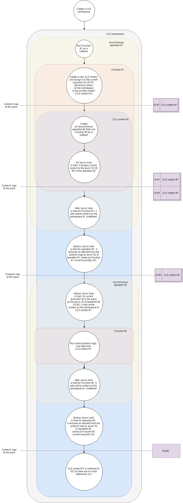

What's nagging you the most when you think about logging in NodeJS? If you ask me I'm gonna say lack of of industry standards for creating trace IDs. Within this article we'll overview how we can create these trace IDs (meaning we're going to briefly examine how continuation local storage a.k.a [CLS](https://github.com/jeff-lewis/cls-hooked) works) and dig deep into how we can utilize [Proxy](https://developer.mozilla.org/en-US/docs/Web/JavaScript/Reference/Global_Objects/Proxy) to make it work with ANY logger.

## Why is it even a problem to have a trace ID for each request in NodeJS?

Well, on platforms that use multi-threading and spawn a new thread for each request. There's a thing called [thread-local storage a.k.a. TLS](https://en.wikipedia.org/wiki/Thread-local_storage), which allows keeping any arbitrary data available to anything within a thread. If you have a native API to do that it's pretty trivial to generate a random ID for each request, put it in TLS and use it in your controller or service later. So what's the deal with NodeJS?
As you know, NodeJS is a single-threaded (not really true anymore as we now have workers, but that doesn't change the big picture) platform, which makes TLS obsolete. Instead of operating different threads NodeJS runs different callbacks within the same thread (there's a [great series of articles](https://jsblog.insiderattack.net/event-loop-and-the-big-picture-nodejs-event-loop-part-1-1cb67a182810) on event loop in NodeJS if you're interested) and NodeJS provides us with a way to uniquely identify these callbacks and trace their relations with each other.

Back in the old days (v0.11.11) we had [addAsyncListener](https://nodejs.org/docs/v0.11.11/api/process.html#process_async_listeners) which allowed us to track asynchronous events. Based on it [Forrest Norvell](https://github.com/othiym23) built first implementation of [continuation local storage a.k.a. CLS](https://github.com/othiym23/node-continuation-local-storage). We're not going to cover that implementation of CLS due to the fact that we, as developers, were stripped of that API in v0.12 already.

Until NodeJS 8 we had no official way of hooking up to NodeJS' async event processing. And finally NodeJS 8 granted us the power we lost via [async_hooks](https://nodejs.org/docs/latest-v11.x/api/async_hooks.html) (if you want to get a better understanding of async_hooks take a look at [this article](https://itnext.io/a-pragmatic-overview-of-async-hooks-api-in-node-js-e514b31460e9)). This brings us to the modern async_hooks-based implementation of CLS - [cls-hooked](https://github.com/Jeff-Lewis/cls-hooked).

## CLS overview

Here's a simplified flow of how CLS works:



Let's break it down step-by-step:

1. Say, we have a typical web server. First we have to create a CLS namespace. Once for the entire lifetime of our application.
2. Second we have to configure a middleware to create a new CLS context for each request. For simplicity let's assume that this middleware is just a callback that is called upon receiving a new request.
3. So when a new request arrives we call that callback function.
4. Within that function we create a new CLS context (one of the ways is to use [run](https://github.com/jeff-lewis/cls-hooked#namespaceruncallback) API call).
5. At this point CLS puts the new context in a map of contexts by [current execution ID](https://nodejs.org/api/async_hooks.html#async_hooks_async_hooks_executionasyncid).
6. Each CLS namespace has `active` property. At this stage CLS assigns `active` to the context.
7. Inside of the context we make a call to an asynchronous resource, say, we request some data from the database. We pass a callback to the call, which is going to run once the request to the database is completed.
8. [init](https://nodejs.org/api/async_hooks.html#async_hooks_init_asyncid_type_triggerasyncid_resource) async hook is fired for new asynchronous operation. It adds the current context to the map of contexts by async ID (consider it an identifier of the new asynchronous operation). Now in that map we two IDs pointing to the same context.
9. As we have no more logic inside of our first callback it exits effectively ending our first asynchronous operation.
10. [after](https://nodejs.org/api/async_hooks.html#async_hooks_after_asyncid) async hook is fired for the first callback. It sets active context on the namespace to `undefined` (it's not always true as we may have multiple nested contexts, but for the most simple case it is true).
11. [destroy](https://nodejs.org/api/async_hooks.html#async_hooks_destroy_asyncid) hook is fired for the first operation. It removes the context from our map of contexts by its async ID (it's the same as current execution ID of our first callback).
12. The request to the database has finished and our second callback is about to be triggered.
13. At this point [before](https://nodejs.org/api/async_hooks.html#async_hooks_before_asyncid) async hook comes in play. Its current execution ID is the same the async ID of the second operation (database request). It sets `active` property of the namespace to the context found by its current execution ID. It's the context that we created before.
14. Now we run our second callback. Run some business logic inside. Within that function we can [get any value by key](https://github.com/jeff-lewis/cls-hooked#namespacegetkey) from the CLS and it is going to return whatever it finds by the key in the context we created before.
15. Assuming that it's the end of processing of the request our function returns.
16. [after](https://nodejs.org/api/async_hooks.html#async_hooks_after_asyncid) async hook is fired for the second callback. It sets active context on the namespace to `undefined`.
17. `destroy` hook is fired for the second asynchronous operation. It removes our context from the map of contexts by its async ID leaving it absolutely empty.
18. As we no longer hold any references to the context object our garbage collector frees the memory associated with it.

It's a simplified version of what's going on under the hood, yet it covers all major steps. If you want to dig deeper you can take a look at the [source code](https://github.com/Jeff-Lewis/cls-hooked/blob/master/context.js). It's less than 500 lines.

## Generating trace IDs

So once we got an overall understanding of CLS let's think how we can utilize it for our own good. One thing we could do is create a middleware that wraps every request in a context, generates a random identifier and puts it in CLS by key `traceID`. Later, inside of one of our gazillion controllers and services we could get that identifier from CLS.

For [express](https://github.com/expressjs/express) this middleware could look like this:

```js
const cls = require('cls-hooked')
const uuidv4 = require('uuid/v4')

const clsNamespace = cls.createNamespace('app')

const clsMiddleware = (req, res, next) => {
  // req and res are event emitters. We want to access CLS context inside of their event callbacks
  clsNamespace.bind(req)
  clsNamespace.bind(res)

  const traceID = uuidv4()

  clsNamespace.run(() => {
    clsNamespace.set('traceID', traceID)

    next()
  })
}
```

Then in our controller we could get the trace ID generated like this:

```js
const controller = (req, res, next) => {
  const traceID = clsNamespace.get('traceID')
}
```

There's not so much use of this trace ID unless we add it to our logs.

Let's add it to our [winston](https://github.com/winstonjs/winston).

```js
const { createLogger, format, transports } = require('winston')

const addTraceId = printf((info) => {
  let message = info.message
  const traceID = clsNamespace.get('taceID')
  if (traceID) {
    message = `[TraceID: ${traceID}]: ${message}`
  }
  return message
})

const logger = createLogger({
  format: addTraceId,
  transports: [new transports.Console()],
})
```

Well, if all loggers supported formatters in a form of functions (many of them don't do that for a good reason) this article wouldn't exist. So how would one add a trace ID to my beloved [pino](https://github.com/pinojs/pino)? [Proxy](https://developer.mozilla.org/en-US/docs/Web/JavaScript/Reference/Global_Objects/Proxy) to the rescue!

## Combining Proxy and CLS

Proxy is an object that wraps our original object allowing us to override its behavior in certain situations. List of these situations (they are actually called traps) is limited and you can take a look at the whole set [here](https://developer.mozilla.org/en-US/docs/Web/JavaScript/Reference/Global_Objects/Proxy#Methods_of_the_handler_object), but we're only interested in trap [get](https://developer.mozilla.org/en-US/docs/Web/JavaScript/Reference/Global_Objects/Proxy/handler/get). It provides us with an ability to intercept property accessing. It means that if we have an object `const a = { prop: 1 }` and wrap it in a Proxy, with `get` trap we could return anything we want for `a.prop`.

So the idea is to generate a random trace ID for each request and create a [child pino logger](https://github.com/pinojs/pino/blob/master/docs/child-loggers.md) with the trace ID and put it in CLS. Then we could wrap our original logger with a Proxy, which would redirect all logging request to the child logger in CLS if found one and keep using the original logger otherwise.

In this scenario our Proxy could look like this:

```js
const pino = require('pino')

const logger = pino()
const loggerCls = new Proxy(logger, {
  get(target, property, receiver) {
    // Fallback to our original logger if there is no child logger in CLS
    target = clsNamespace.get('loggerCls') || target
    return Reflect.get(target, property, receiver)
  },
})
```

Our middleware would transform into something like this:

```js
const cls = require('cls-hooked')
const uuidv4 = require('uuid/v4')

const clsMiddleware = (req, res, next) => {
  // req and res are event emitters. We want to access CLS context inside of their event callbacks
  clsNamespace.bind(req)
  clsNamespace.bind(res)

  const traceID = uuidv4()
  const loggerWithTraceId = logger.child({ traceID })

  clsNamespace.run(() => {
    clsNamespace.set('loggerCls', loggerWithTraceId)

    next()
  })
}
```

And we could use the logger like this:

```js
const controller = (req, res, next) => {
  loggerCls.info('Long live rocknroll!')
  // Logs something like
  // {"level":30,"time":1551385666046,"msg":"Long live rocknroll!","pid":25,"hostname":"eb6a6c70f5c4","traceID":"9ba393f0-ec8c-4396-8092-b7e4b6f375b5","v":1}
}
```

## [cls-proxify](https://github.com/fxlrnrpt/cls-proxify)

Based on the idea above a [small library called cls-proxify](https://github.com/fxlrnrpt/cls-proxify) was created. It has integration with [express](https://github.com/expressjs/express), [koa](https://github.com/koajs/koa) and [fastify](https://github.com/fastify/fastify) out-of-the-box.
It applies not only `get` trap to the original object, but [many others](https://github.com/fxlrnrpt/cls-proxify#does-it-work-only-for-loggers) as well. So there're endless possible applications. You could proxy function calls, class construction, pretty much anything! You're limited only by your imagination!
[Take a look at live demos of using it with pino and fastify, pino and express](https://github.com/fxlrnrpt/cls-proxify#live-demos).

Hopefully, you've found something useful for your project. Feel free to communicate your feedback to me! I most certainly appreciate any criticism and questions.