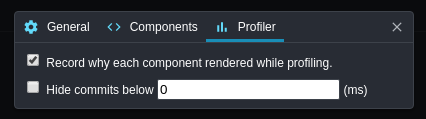
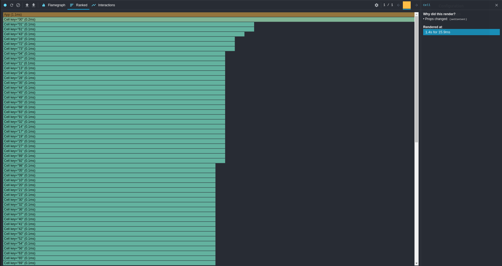
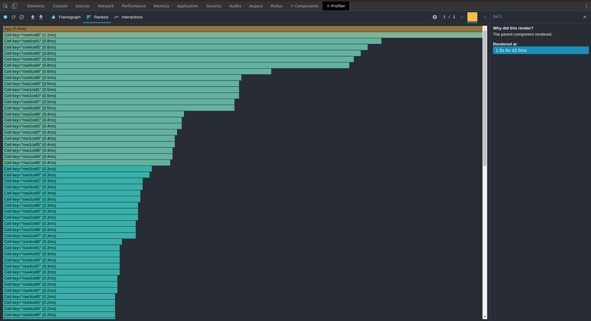
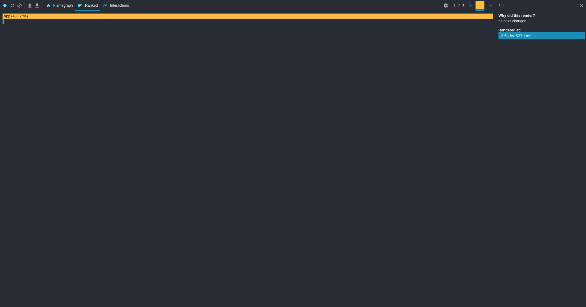
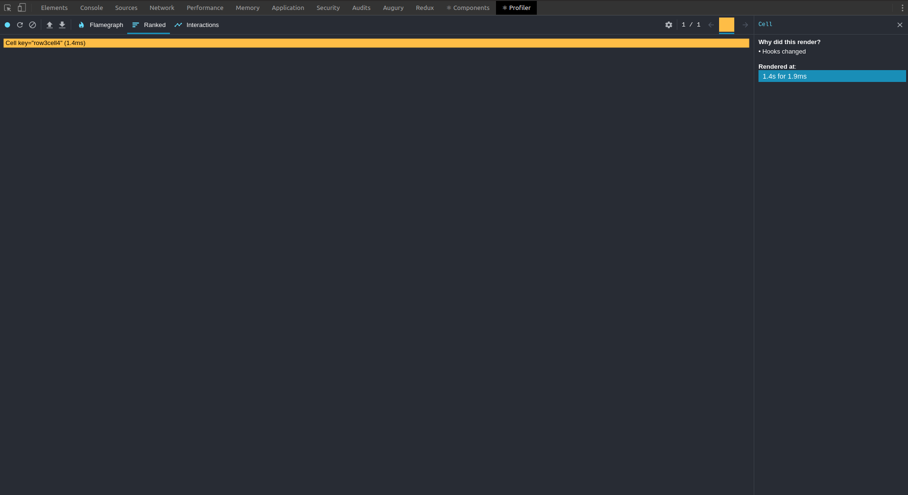

Have you heard about "lifting state up"? I guess you have and that's the exact reason why you're here. How could it be possible that [one of the 12 main concepts listed in React official documentation](https://reactjs.org/docs/lifting-state-up.html) might lead to poor performance? Within this article, we'll consider a situation when it's indeed the case.

## Step 1: Lift it up

I suggest you to create a simple game of tic-tac-toe. For the game we'll need:

- Some game state. No real game logic to find out if we win or lose. Just a simple two-dimensional array filled with either `undefined`, `"x"` or `"0".`

  ```js
  const size = 10
  // Two-dimensional array (size * size) filled with `undefined`. Represents an empty field.
  const initialField = new Array(size).fill(new Array(size).fill(undefined))
  ```

- A parent container to host our game's state.

  ```js
  const App = () => {
    const [field, setField] = useState(initialField)

    return (
      <div>
        {field.map((row, rowI) => (
          <div>
            {row.map((cell, cellI) => (
              <Cell
                content={cell}
                setContent={
                  // Update a single cell of a two-dimensional array
                  // and return a new two dimensional array
                  (newContent) =>
                    setField([
                      // Copy rows before our target row
                      ...field.slice(0, rowI),
                      [
                        // Copy cells before our target cell
                        ...field[rowI].slice(0, cellI),
                        newContent,
                        // Copy cells after our target cell
                        ...field[rowI].slice(cellI + 1),
                      ],
                      // Copy rows after our target row
                      ...field.slice(rowI + 1),
                    ])
                }
              />
            ))}
          </div>
        ))}
      </div>
    )
  }
  ```

- A child component to display a state of a single cell.

  ```js
  const randomContent = () => (Math.random() > 0.5 ? 'x' : '0')

  const Cell = ({ content, setContent }) => (
    <div onClick={() => setContent(randomContent())}>{content}</div>
  )
  ```

[Live demo #1](https://stackblitz.com/edit/lifting-state-up-is-killing-your-app-1)

So far it looks well. A perfectly reactive field that you can interact with at the speed of light :) Let's increase the size. Say, to 100. Yeah, it's time to click on that demo link and change `size` variable on the very top. Still fast for you? Try 200 or use [CPU throttling built into Chrome](https://twitter.com/chromiumdev/status/961537247240753152?lang=en). Do you see now a significant lag between the time you click on a cell and the time its content changes?

Let's change `size` back to 10 and add some profiling to investigate the cause.

```js
const Cell = ({ content, setContent }) => {
  console.log('cell rendered')
  return <div onClick={() => setContent(randomContent())}>{content}</div>
}
```

[Live demo #2](https://stackblitz.com/edit/lifting-state-up-is-killing-your-app-2)

Yep, that's it. Simple `console.log` would suffice as it runs on every render.

So what do we see? Based on the number on "cell rendered" statements (for `size` = N it should be N) in our console it seems like the entire field is re-rendered each time a single cell changes.

The most obvious thing to do is to add some keys as [React documentation suggests](https://reactjs.org/docs/lists-and-keys.html#keys).

```js
<div>
  {field.map((row, rowI) => (
    <div key={rowI}>
      {row.map((cell, cellI) => (
        <Cell
          key={`row${rowI}cell${cellI}`}
          content={cell}
          setContent={(newContent) =>
            setField([
              ...field.slice(0, rowI),
              [
                ...field[rowI].slice(0, cellI),
                newContent,
                ...field[rowI].slice(cellI + 1),
              ],
              ...field.slice(rowI + 1),
            ])
          }
        />
      ))}
    </div>
  ))}
</div>
```

[Live demo #3](https://stackblitz.com/edit/lifting-state-up-is-killing-your-app-3)

However, after increasing `size` again we see that that problem is still there. If only we could see why any component renders... Luckily, we can with some help from amazing [React DevTools](https://reactjs.org/blog/2019/08/15/new-react-devtools.html). It's capable of recording why components get rendered. You have to manually enable it though.



Once it's enabled, we can see that all cells were re-rendered because their props changed, specifically, `setContent` prop.



Each cell has two props: `content` and `setContent`. If cell [0][0] changes, content of cell [0][1] doesn't change. On the other hand, `setContent` captures `field`, `cellI` and `rowI` in its closure. `cellI` and `rowI` stay the same, but `field` changes with every change of any cell.

Let's refactor our code and keep `setContent` the same.

To keep the reference to `setContent` the same we should get rid of the closures. We could eliminate `cellI` and `rowI` closure by making our `Cell` explicitly pass `cellI` and `rowI` to `setContent`. As to `field`, we could utilize a neat feature of `setState` - [it accepts callbacks](https://reactjs.org/docs/hooks-reference.html#functional-updates).

```js
const [field, setField] = useState(initialField)

// `useCallback` keeps reference to `setCell` the same.
const setCell = useCallback(
  (rowI, cellI, newContent) =>
    setField((oldField) => [
      ...oldField.slice(0, rowI),
      [
        ...oldField[rowI].slice(0, cellI),
        newContent,
        ...oldField[rowI].slice(cellI + 1),
      ],
      ...oldField.slice(rowI + 1),
    ]),
  [],
)
```

Which makes `App` look like this

```js
<div>
  {field.map((row, rowI) => (
    <div key={rowI}>
      {row.map((cell, cellI) => (
        <Cell
          key={`row${rowI}cell${cellI}`}
          content={cell}
          rowI={rowI}
          cellI={cellI}
          setContent={setCell}
        />
      ))}
    </div>
  ))}
</div>
```

Now `Cell` has to pass `cellI` and `rowI` to the `setContent`.

```js
const Cell = ({ content, rowI, cellI, setContent }) => {
  console.log('cell render')
  return (
    <div onClick={() => setContent(rowI, cellI, randomContent())}>
      {content}
    </div>
  )
}
```

[Live demo #4](https://stackblitz.com/edit/lifting-state-up-is-killing-your-app-4)

Let's take a look at the DevTools report.



What?! Why the heck does it say "parent props changed"? So the thing is that every time our field is updated `App`is re-rendered. Therefore its child components are re-rendered. Ok. Does stackoverflow say anything useful about React performance optimization? Internet suggests to use `shouldComponentUpdate` or its close relatives: `PureComponent` and `memo`.

```js
const Cell = memo(({ content, rowI, cellI, setContent }) => {
  console.log('cell render')
  return (
    <div onClick={() => setContent(rowI, cellI, randomContent())}>
      {content}
    </div>
  )
})
```

[Live demo #5](https://stackblitz.com/edit/lifting-state-up-is-killing-your-app-5)

Yay! Now only one cell is re-rendered once its content changes. But wait... Was there any surprise? We followed best practices and got the expected result.
An evil laugh was supposed to be here. As I'm not with you, please, try as hard as possible to imagine it. Go ahead and increase `size` in [Live demo #5](https://stackblitz.com/edit/lifting-state-up-is-killing-your-app-5). This time you might have to go with a little bigger number. However, the lag is still there. Why???

Let's take a look at the DebTools report again.



There's only one render of `Cell` and it was pretty fast, but there's also a render of `App`, which took quite some time. The thing is that with every re-render of `App` each `Cell` has to compare its new props with its previous props. Even if it decides not to render (which is precisely our case), that comparison still takes time. O(1), but that O(1) occurs `size` \* `size` times!

## Step 2: Move it down

What can we do to work around it? If rendering `App` costs us too much, we have to stop rendering `App`. It's not possible if keep hosting our state in `App` using `useState`, because that's exactly what triggers re-renders. So we have to move our state down and let each `Cell` subscribe to the state on its own.

Let's create a dedicated class that will be a container for our state.

```js
class Field {
  constructor(fieldSize) {
    this.size = fieldSize
    // Copy-paste from `initialState`
    this.data = new Array(this.size).fill(new Array(this.size).fill(undefined))
  }

  cellContent(rowI, cellI) {
    return this.data[rowI][cellI]
  }

  // Copy-paste from  old `setCell`
  setCell(rowI, cellI, newContent) {
    console.log('setCell')
    this.data = [
      ...this.data.slice(0, rowI),
      [
        ...this.data[rowI].slice(0, cellI),
        newContent,
        ...this.data[rowI].slice(cellI + 1),
      ],
      ...this.data.slice(rowI + 1),
    ]
  }

  map(cb) {
    return this.data.map(cb)
  }
}

const field = new Field(size)
```

Then our `App` could look like this:

```js
const App = () => {
  return (
    <div>
      {// As you can see we still need to iterate over our state to get indexes.
      field.map((row, rowI) => (
        <div key={rowI}>
          {row.map((cell, cellI) => (
            <Cell key={`row${rowI}cell${cellI}`} rowI={rowI} cellI={cellI} />
          ))}
        </div>
      ))}
    </div>
  )
}
```

And our `Cell` can display the content from `field` on its own:

```js
const Cell = ({ rowI, cellI }) => {
  console.log('cell render')
  const content = field.cellContent(rowI, cellI)
  return (
    <div onClick={() => field.setCell(rowI, cellI, randomContent())}>
      {content}
    </div>
  )
}
```

[Live demo #6](https://stackblitz.com/edit/lifting-state-up-is-killing-your-app-6)

At this point, we can see our field being rendered. However, if we click on a cell, nothing happens. In the logs we can see "setCell" for each click, but the cell stays blank. The reason here is that nothing tells the cell to re-render. Our state outside of React changes, but React doesn't know about it. That has to change.

How can we trigger a render programmatically?

With classes we have [forceUpdate](https://reactjs.org/docs/react-component.html#forceupdate). Does it mean we have to re-write our code to classes? Not really. What we can do with functional components is to introduce some dummy state, which we change only to force our component to re-render.

Here's how we can create a custom hook to force re-renders.

```js
const useForceRender = () => {
  const [, forceRender] = useReducer((oldVal) => oldVal + 1, 0)
  return forceRender
}
```

To trigger a re-render when our field updates we have to know when it updates. It means we have to be able to somehow subscribe to field updates.

```js
class Field {
  constructor(fieldSize) {
    this.size = fieldSize
    this.data = new Array(this.size).fill(new Array(this.size).fill(undefined))
    this.subscribers = {}
  }

  _cellSubscriberId(rowI, cellI) {
    return `row${rowI}cell${cellI}`
  }

  cellContent(rowI, cellI) {
    return this.data[rowI][cellI]
  }

  setCell(rowI, cellI, newContent) {
    console.log('setCell')
    this.data = [
      ...this.data.slice(0, rowI),
      [
        ...this.data[rowI].slice(0, cellI),
        newContent,
        ...this.data[rowI].slice(cellI + 1),
      ],
      ...this.data.slice(rowI + 1),
    ]
    const cellSubscriber = this.subscribers[this._cellSubscriberId(rowI, cellI)]
    if (cellSubscriber) {
      cellSubscriber()
    }
  }

  map(cb) {
    return this.data.map(cb)
  }

  // Note that we subscribe not to updates of the whole filed, but to updates of one cell only
  subscribeCellUpdates(rowI, cellI, onSetCellCallback) {
    this.subscribers[this._cellSubscriberId(rowI, cellI)] = onSetCellCallback
  }
}
```

Now we can subscribe to field updates.

```js
const Cell = ({ rowI, cellI }) => {
  console.log('cell render')
  const forceRender = useForceRender()
  useEffect(() => field.subscribeCellUpdates(rowI, cellI, forceRender), [
    forceRender,
  ])
  const content = field.cellContent(rowI, cellI)
  return (
    <div onClick={() => field.setCell(rowI, cellI, randomContent())}>
      {content}
    </div>
  )
}
```

[Live demo #7](https://stackblitz.com/edit/lifting-state-up-is-killing-your-app-7)

Let's play with `size` with this implementation. Try to increase it to the values that felt laggy before. And... It's time to open a good bottle of champagne! We got ourselves an app that renders one cell and one cell only when the state of that cell changes!

Let's take a look at the DevTools report.



As we can see now only `Cell` is being rendered and it's crazy fast.

What if say that now code of our `Cell` is a potential cause of a memory leak? As you can see, in `useEffect` we subscribe to cell updates, but we never unsubscribe. It means that even when `Cell` is destroyed, its subscription lives on. Let's change that.

First, we need to teach `Field` what it means to unsubscribe.

```js
class Field {
  // ...
  unsubscribeCellUpdates(rowI, cellI) {
    delete this.subscribers[this._cellSubscriberId(rowI, cellI)]
  }
}
```

Now we can apply `unsubscribeCellUpdates` to our `Cell`.

```js
const Cell = ({ rowI, cellI }) => {
  console.log('cell render')
  const forceRender = useForceRender()
  useEffect(() => {
    field.subscribeCellUpdates(rowI, cellI, forceRender)
    return () => field.unsubscribeCellUpdates(rowI, cellI)
  }, [forceRender])
  const content = field.cellContent(rowI, cellI)
  return (
    <div onClick={() => field.setCell(rowI, cellI, randomContent())}>
      {content}
    </div>
  )
}
```

[Live demo #8](https://stackblitz.com/edit/lifting-state-up-is-killing-your-app-8)

So what's the lesson here? When does it make sense to move state down the component tree? Never! Well, not really :) Stick to best practices until they fail and don't do any premature optimizations. Honestly, the case we considered above is somewhat specific, however, I hope you'll recollect it if you ever need to display a really large list.

## Bonus step: Real-world refactoring

In the [live demo #8](https://stackblitz.com/edit/lifting-state-up-is-killing-your-app-8) we used global `field`, which should not be the case in a real-world app. To solve it, we could host `field` in our `App` and pass it down the tree using [context]().

```js
const AppContext = createContext()

const App = () => {
  // Note how we used a factory to initialize our state here.
  // Field creation could be quite expensive for big fields.
  // So we don't want to create it each time we render and block the event loop.
  const [field] = useState(() => new Field(size))
  return (
    <AppContext.Provider value={field}>
      <div>
        {field.map((row, rowI) => (
          <div key={rowI}>
            {row.map((cell, cellI) => (
              <Cell key={`row${rowI}cell${cellI}`} rowI={rowI} cellI={cellI} />
            ))}
          </div>
        ))}
      </div>
    </AppContext.Provider>
  )
}
```

Now we can consume `field` from the context in our `Cell`.

```js
const Cell = ({ rowI, cellI }) => {
  console.log('cell render')
  const forceRender = useForceRender()
  const field = useContext(AppContext)
  useEffect(() => {
    field.subscribeCellUpdates(rowI, cellI, forceRender)
    return () => field.unsubscribeCellUpdates(rowI, cellI)
  }, [forceRender])
  const content = field.cellContent(rowI, cellI)
  return (
    <div onClick={() => field.setCell(rowI, cellI, randomContent())}>
      {content}
    </div>
  )
}
```

[Live demo #9](https://stackblitz.com/edit/lifting-state-up-is-killing-your-app-9)

Hopefully, you've found something useful for your project. Feel free to communicate your feedback to me! I most certainly appreciate any criticism and questions.